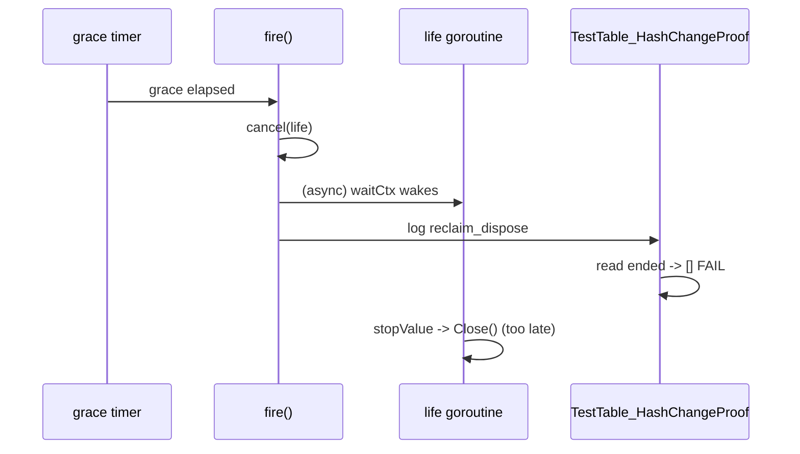

Developer review: in progress — 2026-09-08T14:28:33Z

## What this changes
**Operators.** None.

**Admin users.** None.

**Developers.** None yet — only the ticket bus (`devstate/`) and the upstream research packet are on the branch; explore has located the flake causes but no product file has moved.

**End users.** None.

## Motivation
`pkg/reclaim` is the table that lets one database handle survive a Traefik dynamic-config reload: the old middleware's context is canceled, and if the next `New` opens the same key inside the grace window, the same `*BIN`/`*MMDB` (and its update ticker) is reused instead of re-downloading and re-opening the file. Because that behavior is defined against wall-clock grace, the tests that prove it are written against wall-clock grace too — and on `master` two of them are unwinnable races rather than assertions.

On `master`, `go test -v ./...` fails intermittently in the `Test` job for two distinct reasons, both reproduced in this worktree under CPU contention:

1. `TestTable_HashChangeProof` waits for the `reclaim_dispose` log line and then reads the value's `Close()` side effect. But `fire` cancels the lifetime and logs dispose, while `Close()` runs on a *separate* per-slot goroutine watching that lifetime. The log wins the race and the test reports `ended: []`.
2. `TestTable_ReclaimRacesFire` sets grace to 3 ms, waits for `reclaim_orphan`, then requires the next `Open` to return the *same* pointer. When the 3 ms timer wins — which is correct component behavior — the test fails with `round N reclaim lost the value`. 10 of 25 stressed runs failed this way.

There is also a third, narrower defect found by reading the code: `drop` arms the grace timer and *then* logs `reclaim_orphan`, so with a small grace an operator can see `reclaim_dispose` before `reclaim_orphan` for the same key, and the per-key sequence assertions are unsound.

Not merging leaves every PR in this repo one coin flip away from a red `Test` job, which trains everyone to re-run CI instead of reading it — and the day a real reclaim regression lands, "just re-run it" is exactly the wrong reflex. It also leaves `reclaim_dispose` documented as the end-of-incarnation signal while it can be emitted before the database handle is actually closed.

## Merge readiness
Explore is complete and the fix shape is chosen; no product code has been written yet. 7 items remain.

Priority: P2 — a coin-flip red `Test` job on every PR, plus a `reclaim_dispose` line that can precede both the orphan line and the actual `Close()`; the workaround today is re-running CI.
Reviewed head: fbe70b4
Owner decision: Required. See Decision needed.

## Review scores
| Measure | Result | What it means |
| --- | --- | --- |
| Overall readiness | 3/6 | Causes are reproduced and the fix is designed, but nothing is implemented |
| CI proof | 3/6 | Run 34238445935 in progress on the explore commit — https://github.com/david-garcia-garcia/traefik-geoblock/actions/runs/34238445935 |
| Local tests proof | N/A | Implement has not run |
| Review resolution | 6/6 | No reviewer comments on PR #82 |

## Verification
| Check | Result | Evidence |
| --- | --- | --- |
| Branch | 2026-09-08-fix-reclaim pushed | `git push` (fbe70b4) |
| OpenSpec | none | `openspec/` |
| Pull request | https://github.com/david-garcia-garcia/traefik-geoblock/pull/82 | pr-host List/Create |
| CI | run 34238445935 in_progress https://github.com/david-garcia-garcia/traefik-geoblock/actions/runs/34238445935 | pr-host check runs |
| Local tests | none | handoff.yaml localTests |
| PR comments | no comments | devstate/comments.md |

## Specs
None.

## Follow-up issues
None.

## How this fits together
Local ticket `2026-09-08-fix-reclaim` runs in its own worktree on branch `2026-09-08-fix-reclaim`, which is already open as PR #82 against `master`; CI on that PR is the merge gate, and this card is the PR summary.

## Decision needed
| Question | Decision | By |
| --- | --- | --- |
| Which CI runs actually failed on `pkg/reclaim`, and with which message? | assumed — GitHub Actions job logs are not reachable from this box (no `gh` CLI, no Actions tool in the available MCP namespaces, raw log URLs 403). No specific CI run is claimed as evidence; local reproduction under CPU contention is the evidence of record. | explore |
| Should `pkg/dbwrappers/reclaim_test.go` be hardened too, even though it did not flake in the stress runs? | assumed — yes. It asserts the same "reclaim wins a short timer window" shape (25 ms lease) that reproduced in `pkg/reclaim`, and the edit stays inside test files. | explore |
| Should the upstream `traefik-modsecurity` copy get the same component fix so the two trees stop drifting? | assumed — out of scope for this PR; the human owns both repos. | explore |

## Before merge
- [ ] [P2] Make `Close()` run synchronously before `reclaim_dispose` is logged, and drop the per-slot lifetime goroutine
- [ ] [P2] Order `reclaim_orphan` before the grace timer is armed without logging under the table mutex
- [ ] [P2] Make the race-stress tests assert both legal outcomes instead of requiring reclaim to win
- [ ] [P3] Port the upstream variable renames in `table.go` for parity with `traefik-modsecurity`
- [ ] [P3] Add the missing coverage (nil-`Done` holder, `ResetWith` grace, logger ownership, goroutine-count proof, repeated reclaim cycles)
- [ ] [P3] Harden the 25 ms lease windows and fixed 80 ms sleeps in `pkg/dbwrappers/reclaim_test.go`
- [ ] [P2] Green CI on PR #82

## Findings
None.

## Axis review
None.

## Agent review details

### Review metrics
| Metric | Value | Why it matters |
| --- | --- | --- |
| Specs in this PR | none | Same list as ## Specs; do not paste diff --stat |
| Open reviewer comments walked | 0 FIX / 0 ANSWER / 0 open | Unanswered review is merge risk |
| Reviewed head | fbe70b4d540a0c8b46e88a217b4d456d82b35dbf | Card must match the branch you measured |

### Stored data model
None.

### Technical review
Best possible solution: not yet built — but the chosen shape fixes the component rather than adding waits to the tests, which is what upstream did.

Do we have a high-confidence way to reproduce? Yes — eight background CPU burners plus `go test ./pkg/reclaim/ -count=25` fails `TestTable_ReclaimRacesFire` about 40% of runs and `TestTable_HashChangeProof` intermittently; both pass on an idle box.

Is this the best way to solve the issue? Yes — the upstream delta alone (a `waitUntil` in one test) hides cause 1 and does nothing for cause 2, which is the dominant failure.

### Evidence
What I checked:
- Upstream `pkg/reclaim` fetched and diffed file-by-file: `default.go` identical, `table.go` renames only, `table_test.go` +6 lines (`knowledge/research/ext_traefik-modsecurity_reclaim_table/notes.md`)
- `TestTable_HashChangeProof` fails `ended: []` under contention (`go test ./pkg/reclaim/ -count=8`)
- `TestTable_ReclaimRacesFire` fails `reclaim lost the value` in 10 of 25 stressed runs (`go test ./pkg/reclaim/ -count=25`)
- `pkg/dbwrappers` reclaim tests passed 6 stressed runs — latent, not reproduced (`go test ./pkg/dbwrappers/ -run "Reclaim|HashChange|OpenBIN|OpenMMDB" -count=6`)
- CI runs `go test -v ./...` on `ubuntu-latest` with Go 1.21 and no `-race` (`.github/workflows/ci.yml:38`)
- The mutex-logging constraint that rules out the naive ordering fix (`openspec/specs/std_go_reclaim_context-lease/spec.md`)

### Rank-up moves
- Consider whether the holder `watch` goroutine should park forever for a `context.Background()` holder, or refuse that case outside tests.
