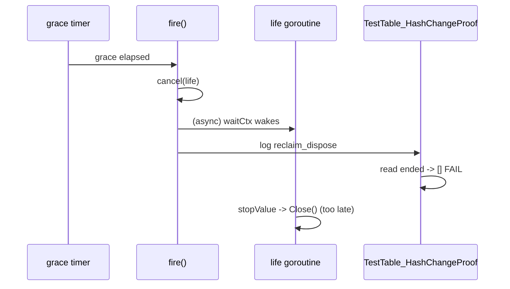
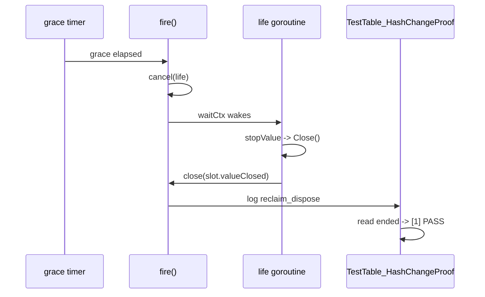

Developer review: in progress — 2026-09-08T15:47:22Z

## What this changes
**Operators.** A `reclaim_dispose` line in the logs now means the database handle behind that key is already closed, and it can no longer appear before the `reclaim_orphan` line for the same key. No configuration changes.

**Admin users.** None.

**Developers.** `pkg/reclaim` gains two guarantees and nothing is taken away. `reclaim_dispose` is emitted only after the stored value's `Close()` has returned, so it is a completion signal rather than a hint — the cost is that a value which blocks in `Close()` now blocks whoever ended the incarnation, which the spec forbids. `reclaim_orphan` is emitted before grace is armed, so the per-key sequence is stable at any grace including zero. The package goes from 26 to 42 tests, covering the two new guarantees, the grace edge, and the paths no test reached before. `pkg/reclaim` is a copy shared with `traefik-modsecurity`, so every edit here is additive by rule and ports back as a file copy.

**End users.** None.

## Motivation
`pkg/reclaim` is the table that lets one database handle survive a Traefik dynamic-config reload: the old middleware's context is canceled, and if the next `New` opens the same key inside the grace window, the same `*BIN`/`*MMDB` (and its update ticker) is reused instead of re-downloading and re-opening the file. Because that behavior is defined against wall-clock grace, the tests that prove it are written against wall-clock grace too — and on `master` two of them are unwinnable races rather than assertions.

On `master`, `go test -v ./...` fails intermittently in the `Test` job for two distinct reasons, both reproduced in this worktree under CPU contention:

1. `TestTable_HashChangeProof` waits for the `reclaim_dispose` log line and then reads the value's `Close()` side effect. But `fire` cancels the lifetime and logs dispose, while `Close()` runs on a *separate* per-slot goroutine watching that lifetime. The log wins the race and the test reports `ended: []`.
2. `TestTable_ReclaimRacesFire` sets grace to 3 ms, waits for `reclaim_orphan`, then requires the next `Open` to return the *same* pointer. When the 3 ms timer wins — which is correct component behavior — the test fails with `round N reclaim lost the value`. 10 of 25 stressed runs failed this way.

There is also a third, narrower defect: `drop` arms the grace timer and *then* logs `reclaim_orphan`, so with a small grace an operator can see `reclaim_dispose` before `reclaim_orphan` for the same key, and the per-key sequence assertions are unsound. Found by reading the code, then reproduced against `master`: the new `TestTable_OrphanPrecedesDisposeAtTinyGrace` recorded `[put, bind, dispose, orphan]` on round 57 of 300.

Not merging leaves every PR in this repo one coin flip away from a red `Test` job, which trains everyone to re-run CI instead of reading it — and the day a real reclaim regression lands, "just re-run it" is exactly the wrong reflex. It also leaves `reclaim_dispose` documented as the end-of-incarnation signal while it can be emitted before the database handle is actually closed.

The end of an incarnation on `master`, where the dispose line does not wait for anything:

The same path on this branch. The goroutine stays; `fire` now waits for it:

## Merge readiness
Implement and code review are both complete. Seven axes ran on Opus against the pinned diff and returned 27 findings (10 hard); 24 are applied, 3 are argued and left with measurements. Two of them were real defects in this change rather than style: an incarnation that could be stranded forever by the new arming window, and two `pkg/dbwrappers` tests that were never taking the reclaim branch they claim to test. The full local suite is green, 8 stressed runs under twelve CPU burners at `GOMAXPROCS=2` are green where `master` failed within two, and CI is green on the pre-review head. 1 item remains: CI on the review head.

Priority: P2 — a coin-flip red `Test` job on every PR, plus a `reclaim_dispose` line that can precede both the orphan line and the actual `Close()`; the workaround today is re-running CI.
Reviewed head: 4735753
Owner decision: Not required for the code. One decision was taken by the human this round and is recorded below.

## Review scores
| Measure | Result | What it means |
| --- | --- | --- |
| Overall readiness | 5/6 | Fixed, reviewed on seven axes, proven against `master`, and stress-clean; CI on the review head is the remaining gate |
| CI proof | 5/6 | Run 34241944768 green on 995849a (Test, Lint, Integration Tests) — https://github.com/david-garcia-garcia/traefik-geoblock/actions/runs/34241944768 — but 4735753 has not finished CI yet |
| Local tests proof | 6/6 | `go test ./...` green; `-count=8` on `pkg/reclaim` + `pkg/dbwrappers` green under twelve CPU burners at `GOMAXPROCS=2`, plus `-count=25` under eight burners before the review fixes |
| Review resolution | 6/6 | 27 axis findings: 24 applied, 3 argued with measurements, 0 open; no reviewer comments on PR #82 |

## Verification
| Check | Result | Evidence |
| --- | --- | --- |
| Branch | 2026-09-08-fix-reclaim pushed | `git push` (4735753) |
| OpenSpec | reclaim-dispose-determinism valid | `openspec validate --strict reclaim-dispose-determinism` |
| Pull request | https://github.com/david-garcia-garcia/traefik-geoblock/pull/82 | pr-host List/Create |
| CI | run 34241944768 success on 995849a (Test, Lint, Integration Tests) https://github.com/david-garcia-garcia/traefik-geoblock/actions/runs/34241944768 | pr-host check runs |
| Local tests | `go test ./...` all 10 packages ok; `-count=8` stressed green at `GOMAXPROCS=2` under twelve burners | shell, this worktree |
| Code review | 7 axes on Opus, 27 findings, 24 applied / 3 argued / 0 open | `devstate/2026/09/2026-09-08-fix-reclaim/codereview_*.md` |
| Regression proof | 4 new tests fail on `origin/master`'s `table.go` in all 3 runs; a 5th fails within 57 rounds | scratch module `tmp-reclaim-proof2` |
| Lint | no findings; `golangci-lint` gofmt hits are the CRLF working tree and include untouched `default.go` | `golangci-lint run ./pkg/reclaim/... ./pkg/dbwrappers/...`, `gofmt -l` on LF copies is empty |
| PR comments | no comments | devstate/comments.md |

## Specs
| Spec | Change | Where |
| --- | --- | --- |
| `std_go_reclaim_context-lease` | 2 requirements added (dispose implies Close returned; either side of the grace edge is correct), 1 modified (orphan precedes dispose at every grace) | `openspec/changes/reclaim-dispose-determinism/specs/` |

## Follow-up issues
- Port this change to `david-garcia-garcia/traefik-modsecurity` `pkg/reclaim`. The two copies are kept in sync in both directions; the port is a file copy of `table.go`, `default.go` and `table_test.go`, plus the equivalent test-support changes if that repo has the same integration tests. Not done here because it is a different repository.
- `pkg/dbsource`: `Updater.Stop` does not wait for the update goroutine, and `tick` never checks for stop before downloading, so a disposed wrapper can still write into a directory `t.TempDir` is removing. That is why `settleFirstTick` exists in `pkg/dbwrappers/reclaim_test.go`. The fix is to cancel the in-flight request and join the goroutine; out of scope for a reclaim ticket.

## How this fits together
Local ticket `2026-09-08-fix-reclaim` runs in its own worktree on branch `2026-09-08-fix-reclaim`, which is already open as PR #82 against `master`; CI on that PR is the merge gate, and this card is the PR summary.

## Decision needed
| Question | Decision | By |
| --- | --- | --- |
| Which CI runs actually failed on `pkg/reclaim`, and with which message? | assumed — GitHub Actions job logs are not reachable from this box (no `gh` CLI, no Actions tool in the available MCP namespaces, raw log URLs 403). No specific CI run is claimed as evidence; local reproduction under CPU contention is the evidence of record. | explore |
| Should `pkg/dbwrappers/reclaim_test.go` be hardened too, even though it did not flake in the stress runs? | assumed — yes. It asserts the same "reclaim wins a short timer window" shape (25 ms lease) that reproduced in `pkg/reclaim`, and the edit stays inside test files. | explore |
| Should the upstream `traefik-modsecurity` copy get the same component fix so the two trees stop drifting? | resolved by the human — yes, and as a standing rule: this component is synced in both directions across projects, so changes here port there and vice versa, and nothing may be removed. Written into `knowledge/devdocs/std_go_reclaim.md`. | implement |
| Does upstream carry features this repo lacks (the human asked about "sleep and wake")? | resolved — no. Upstream `pkg/reclaim` is three files and a code search for `Wake`/`Sleep` in that repo returns zero hits. If such a feature exists it is in another project. | implement |
| Should the lifetime context and its per-slot goroutine be deleted, since closing inline is simpler? | resolved by the human — no. The no-removal rule applies even to code unreachable from this repo, so `fire`/`Reset` wait on a `valueClosed` channel instead. | implement |

## Before merge
- [x] [P2] Make `reclaim_dispose` imply `Close()` has returned — done additively, via a `valueClosed` channel the lifetime goroutine closes and `fire`/`Reset` wait on
- [x] [P2] Order `reclaim_orphan` before the grace timer is armed without logging under the table mutex
- [x] [P2] Make the race-stress tests assert both legal outcomes instead of requiring reclaim to win
- [x] [P3] Port the upstream variable renames in `table.go` for parity with `traefik-modsecurity`
- [x] [P3] Add the missing coverage (nil-`Done` holder, `ResetWith` grace, logger ownership, goroutine leak guard, repeated reclaim cycles)
- [x] [P3] Harden the 25 ms lease windows and fixed 80 ms sleeps in `pkg/dbwrappers/reclaim_test.go`
- [x] [P2] Code review of the component change — seven axes on Opus, 27 findings, 24 applied and 3 argued
- [ ] [P2] Green CI on PR #82 for the review head 4735753 (run 34241944768 was green on 995849a)

## Findings
| Finding | Where | Why it matters |
| --- | --- | --- |
| Making `Close()` precede the dispose line inverts the two observables, which broke three tests that had used a `Close`-side flag as a proxy for "dispose was logged" | `TestTable_OpenCancelDispose`, `TestTable_ZeroGraceEndsImmediately`, `TestTable_ConcurrentCancelLastHolders` | Surfaced only under the stress harness, one iteration after the fix looked done. All three now wait for the line and assert the flag after it, which makes each a second check of the new guarantee. The rule is in the devdocs gotchas. |
| The arming window this change adds could strand an incarnation forever | `pkg/reclaim/table.go` `drop` | An `Open` that reclaimed and released inside the orphan window returned early on `arming`, and the original `drop` then bailed because the generation had moved — leaving the slot mapped with no holders, no timer, and a value never closed. `drop` now arms against the state it reads at re-lock. `TestTable_ReclaimAndReleaseInsideOrphanWindowStillArms` drives the interleaving with a log handler that blocks on the orphan line; it times out on the pre-fix code. Found by the performance axis, not by any test. |
| Two `pkg/dbwrappers` tests were never taking the reclaim branch they are named for | `TestOpenBIN_SameHashReclaimKeepsTicker`, `TestOpenMMDB_SameHashReclaimKeepsTicker` | Wiring up the event recorder the coverage axis asked for showed the recorded events were put, bind, bind — no orphan, no reclaim. Cancelling a holder and calling `Open` straight after usually lands before the holder's watcher goroutine has dropped, so it was a plain second bind and the pointer-equality assert was trivially true. Both now wait for `reclaim_orphan` first and assert the reclaim line; runtime fell to 0.05 s. The trap is in the devdocs gotchas. |

## Axis review
All seven axes ran on Opus, each against the diff pinned at 995849a.

| Axis | Findings | Applied | Argued | Worst finding |
| --- | --- | --- | --- | --- |
| Standards | 5 (4 hard) | 5 | 0 | The slot's `closed` field named the slot, not the fact it carries — the exact conflation this change exists to separate. Now `valueClosed` |
| Nitpicks | 5 (3 hard) | 5 | 0 | Test names and locals that described the mechanism instead of the behavior (`armingGen`, `useLeases`, `...DisposesQuietly`) |
| Spec | 4 | 4 | 0 | The delta spec claimed `reclaim_orphan` always precedes `reclaim_dispose` "at every grace", which `Reset` does not honor. The requirement now states both exceptions |
| Security | 0 | — | — | No findings. The change adds no input handling, no logging of untrusted data, and no new lock ordering |
| Performance | 4 (1 hard) | 2 | 2 | **A real leak introduced by this change**: the new arming window could strand an incarnation mapped with no holders and no timer, its value never closed |
| Dead code | 2 | 1 | 1 | An unreachable nil-channel guard in `waitClosed`; the helper is gone and `fire`/`Reset` receive directly |
| Test coverage | 7 (2 hard) | 7 | 0 | The arming window — the state this change adds — had no test that entered it through `drop` |

The three argued findings are recorded in the axis files with the measurement that justifies them: two are wall-clock trims that would remove a regression guard (the 40 rounds first catch the defect on round 57, and the `pkg/dbwrappers` sleeps are covering a `pkg/dbsource` shutdown gap, now a follow-up), and one is a pre-existing test-only production symbol.

## Agent review details

### Review metrics
| Metric | Value | Why it matters |
| --- | --- | --- |
| Specs in this PR | `std_go_reclaim_context-lease` | Same list as ## Specs; do not paste diff --stat |
| Tests in `pkg/reclaim` | 26 → 42 | The component this PR is about had no coverage of its own end-of-incarnation ordering (`go test -list`) |
| New tests that fail on `master` | 5 | A test that passes on the buggy code proves nothing. The two tests added during review pin the arming state, which `master` does not have, so they are measured against the pre-fix version of this branch instead |
| Axis findings | 27 found / 24 applied / 3 argued / 0 open | Seven axes on Opus; two findings were defects in this change, not style |
| Open reviewer comments walked | 0 FIX / 0 ANSWER / 0 open | Unanswered review is merge risk |
| Reviewed head | 4735753af0fc6f6821689cfc89a54547a478812b | Card must match the branch you measured |

### Stored data model
None.

### Technical review
Best possible solution: it fixes the component rather than adding waits to the tests, which is what upstream did, and it does so without removing anything — the shared-copy rule makes additive the only acceptable shape. The one alternative worth naming is deleting the lifetime goroutine and calling `Close()` inline; that is a smaller file and was rejected on the no-removal rule.

Do we have a high-confidence way to reproduce? Yes — eight background CPU burners plus `go test ./pkg/reclaim/ -count=25` fails `TestTable_ReclaimRacesFire` about 40% of runs and `TestTable_HashChangeProof` intermittently; both pass on an idle box.

Is this the best way to solve the issue? Yes — the upstream delta alone (a `waitUntil` in one test) hides cause 1 and does nothing for cause 2, which is the dominant failure.

### Evidence
What I checked:
- Upstream `pkg/reclaim` fetched and diffed file-by-file: `default.go` identical, `table.go` renames only, `table_test.go` +6 lines (`knowledge/research/ext_traefik-modsecurity_reclaim_table/notes.md`)
- `TestTable_HashChangeProof` fails `ended: []` under contention (`go test ./pkg/reclaim/ -count=8`)
- `TestTable_ReclaimRacesFire` fails `reclaim lost the value` in 10 of 25 stressed runs (`go test ./pkg/reclaim/ -count=25`)
- `pkg/dbwrappers` reclaim tests passed 6 stressed runs — latent, not reproduced (`go test ./pkg/dbwrappers/ -run "Reclaim|HashChange|OpenBIN|OpenMMDB" -count=6`)
- CI runs `go test -v ./...` on `ubuntu-latest` with Go 1.21 and no `-race` (`.github/workflows/ci.yml:38`)
- The mutex-logging constraint that rules out the naive ordering fix (`openspec/specs/std_go_reclaim_context-lease/spec.md`)

What I checked after the fix:
- `go test ./...` — all 10 packages ok
- `go test ./pkg/reclaim/ ./pkg/dbwrappers/ -count=25` under eight CPU burners — green (44.6 s and 17.4 s); the same harness failed `master` within two iterations
- The new tests built against `origin/master`'s `table.go` in a scratch module fail there in all 3 runs: `TestTable_DisposeLogFollowsClose`, `TestTable_ResetDisposeLogFollowsClose`, `TestTable_RepeatedReclaimCyclesKeepOneIncarnation`, `TestTable_ReclaimRacesFire`; `TestTable_OrphanPrecedesDisposeAtTinyGrace` fails there on round 57 of 300 with `[put, bind, dispose, orphan]`
- `openspec validate --strict reclaim-dispose-determinism` — valid
- Upstream `pkg/reclaim` re-checked for the features the human asked about: three files, zero hits for `Wake` or `Sleep` in the whole repo

What I checked after the review fixes (head 4735753):
- `go build ./...`, `go vet ./...`, `go test ./...` — all 10 packages ok
- `go test ./pkg/reclaim/ ./pkg/dbwrappers/ -count=8` under twelve CPU burners at `GOMAXPROCS=2` — green
- `TestTable_OpenInsideOrphanWindowKeepsIncarnationLive` `-count=5` green; the arming window is now entered through `drop` rather than by hand-setting the flag
- `TestTable_GoroutinesReturnToBaseline` at `slack=2` (was 8): 25 solo runs and 8 full-suite runs green
- The two `SameHashReclaimKeepsTicker` tests now record `reclaim_reclaim`; before the fix their event stream was put, bind, bind
- `openspec validate --strict reclaim-dispose-determinism` — valid

### Rank-up moves
- Consider whether the holder `watch` goroutine should park forever for a `context.Background()` holder, or refuse that case outside tests.
