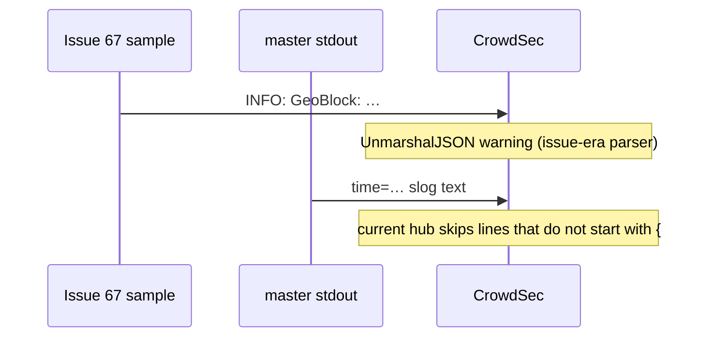

Developer review: in progress — 2026-09-08T12:44:27Z

IssueKey: 2026-09-08-non-json-logs
JobName: 2026-09-08-non-json-logs

Upstream: [PascalMinder/geoblock#67](https://github.com/PascalMinder/geoblock/issues/67)

## What this changes
**Operators.** None.

**Admin users.** None.

**Developers.** Explore journal plus a debt note that `NewBootstrap` / `NewOwner` stay text when `logFormat` is json. No stdout format change versus `master` yet.

**End users.** None.

## Motivation
[PascalMinder/geoblock#67](https://github.com/PascalMinder/geoblock/issues/67) reports CrowdSec `crowdsecurity/traefik-logs` failing `UnmarshalJSON` on GeoBlock lines shaped `INFO: GeoBlock: …`. On `master`, measured stdout is slog `time=… level=INFO` (or JSON when `logFormat: json`). That prefix is gone. Nothing in the tree asserts it stays gone, or that json lines are full-line JSON objects CrowdSec can skip or decode.

If we do not add that proof, a later logger change can bring back a non-JSON first byte or the old prefix and CrowdSec warnings return without a failing test.

## Merge readiness
Explore recorded; tests and spec not written. CI on the bus commits is still running.

Priority: P3 — DestBranch already lacks the filed prefix; this PR must lock that with tests.
Reviewed head: 2885ed6
Owner decision: Required. See Decision needed.

## Review scores
| Measure | Result | What it means |
| --- | --- | --- |
| Overall readiness | 3/6 | Explore done; product tests not landed; CI in progress. |
| CI proof | 3/6 | Lint, Test, Integration Tests queued on [run 34227758322](https://github.com/david-garcia-garcia/traefik-geoblock/actions/runs/34227758322). |
| Local tests proof | N/A | Before implement (`none`). |
| Review resolution | 6/6 | No open PR review comments. |

## Verification
| Check | Result | Evidence |
| --- | --- | --- |
| Branch | 2026-09-08-non-json-logs pushed | git `2885ed6` |
| OpenSpec | none | openspec/ |
| Pull request | https://github.com/david-garcia-garcia/traefik-geoblock/pull/81 | GitHub PR 81 |
| CI | build 34227758322 in progress https://github.com/david-garcia-garcia/traefik-geoblock/actions/runs/34227758322 | GitHub check runs queued |
| Local tests | none | handoff.yaml localTests |
| PR comments | no comments | comments: none |
| Upstream issue status comment | Set skipped | No write access to PascalMinder/geoblock#67 |

## Specs
None.

## Follow-up issues
- [ ] [Bootstrap and owner loggers ignore `logFormat`](https://github.com/david-garcia-garcia/traefik-geoblock/blob/2026-09-08-non-json-logs/knowledge/debt/2026-09-08-bootstrap-owner-logformat.md) — NewBootstrap and NewOwner always emit text even when logFormat is json.

## How this fits together
Upstream [PascalMinder/geoblock#67](https://github.com/PascalMinder/geoblock/issues/67) → branch 2026-09-08-non-json-logs → stub PR 81 → explore at `devstate/2026/09/2026-09-08-non-json-logs/explore.md`.

## Decision needed
| Question | Decision | By |
| --- | --- | --- |
| Does current CrowdSec hub still UnmarshalJSON every Traefik line, or only lines that start with `{`? | assumed — hub master YAML uses `startsWith "{"` before UnmarshalJSON; this run treats current hub as skip-non-JSON | explore |
| Should CreateConfig default `logFormat` become `json`? | assumed — no. The filed format is absent; flipping the default is extra | explore |
| Must `NewBootstrap` / `NewOwner` honor `logFormat`? | assumed — not this run. Note as follow-up | explore |
| Does CrowdSec require Traefik access-log JSON fields on plugin lines? | assumed — any JSON object avoids UnmarshalJSON failure; slog JSON is enough | explore |

## Before merge
- [ ] [P3] Tests that lock no `INFO: GeoBlock:` prefix and that `logFormat: json` lines `json.Unmarshal`
- [ ] Green CI on PR 81

## Findings
None.

## Axis review
None.

## Agent review details

### Review metrics
| Metric | Value | Why it matters |
| --- | --- | --- |
| Specs in this PR | none | Explore only |
| Open reviewer comments walked | 0 FIX / 0 ANSWER / 0 open | No review comments |
| Reviewed head | 2885ed6721e2c80d4dfb2c9b792a660138c8c942 | After explore commit |

### Stored data model
None.

### Technical review
Best possible solution: lock measured stdout (no #67 prefix; json lines are JSON) with package tests; do not flip the default format.

Do we have a high-confidence way to reproduce? Yes — throwaway `go run` captured New/NewBootstrap/NewOwner/CreateConfig bytes on 2026-09-08. The #67 prefix is not reproduced.

Is this the best way to solve the issue? Yes versus DestBranch — the filed bug is absent; missing proof is the gap.

### Evidence
What I checked:
- Measured stdout via throwaway `go run` against `pkg/logging` + `CreateConfig` (prefix absent; default text; json Unmarshal true)
- CrowdSec hub `traefik-logs.yaml` public snippet: `startsWith "{"` before UnmarshalJSON
- `pkg/logging/logging_test.go` has no prefix or full-line JSON assert

### Rank-up moves
None.
