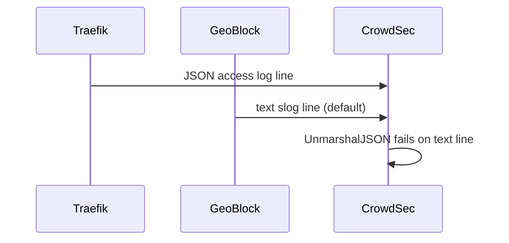

Developer review: in progress — 2026-09-08T12:40:05Z

IssueKey: 2026-09-08-non-json-logs
JobName: 2026-09-08-non-json-logs

[sgsi-dev-ticket-status:2026-09-08-non-json-logs]

## What this changes
**Operators.** None.

**Admin users.** None.

**Developers.** None — prepare only; requirement grounded on upstream PascalMinder/geoblock#67.

**End users.** None.

## Motivation
Operators pipe Traefik process stdout (JSON access logs plus middleware output) into CrowdSec’s `crowdsecurity/traefik-logs` parser. GeoBlock’s default `logFormat: text` emits plain slog lines on the same stream, so the parser’s JSON unmarshal fails (`invalid character 'I' looking for beginning of value`) and CrowdSec logs warnings instead of ingesting access events.

If we do not merge a fix, every shared-log CrowdSec deployment keeps noisy parse failures or forces operators to discover and set `logFormat: json` without guidance; bootstrap/owner log paths may still emit text even when json is configured.

## Merge readiness
Prepare complete; explore not started. 0 product changes on branch.

Priority: P2 — real operator pain when CrowdSec ingests combined Traefik stdout; workaround exists (`logFormat: json`) but is undocumented for this case and may not cover bootstrap logs.
Reviewed head: 64e3b36
Owner decision: Required. See Decision needed.

## Review scores
| Measure | Result | What it means |
| --- | --- | --- |
| Overall readiness | 1/6 | Stub PR open; no product delta; CI not measured. |
| CI proof | 1/6 | Pushed; checks not seen yet. |
| Local tests proof | N/A | Before implement (`none`). |
| Review resolution | N/A | No PR review comments inventoried. |

## Verification
| Check | Result | Evidence |
| --- | --- | --- |
| Branch | 2026-09-08-non-json-logs pushed | git origin/2026-09-08-non-json-logs 64e3b36 |
| OpenSpec | none | openspec/ |
| Pull request | https://github.com/david-garcia-garcia/traefik-geoblock/pull/81 | GitHub PR 81 |
| CI | not seen | not measured |
| Local tests | none | handoff.yaml localTests |
| PR comments | no comments | Comment-List empty |
| Upstream issue status comment | Set skipped | No write access to PascalMinder/geoblock#67 |

## Specs
None.

## Follow-up issues
None.

## How this fits together
Upstream PascalMinder/geoblock#67 → branch 2026-09-08-non-json-logs → stub PR 81 → prepare bus at devstate/2026/09/2026-09-08-non-json-logs/.

## Decision needed
| Question | Decision | By |
| --- | --- | --- |
| Fix scope: default json, bootstrap/owner json parity, docs only, or other? | assumed — explore will choose smallest delta that stops CrowdSec parse failures | prepare |
| Does CrowdSec accept plugin slog JSON or only Traefik access-log JSON shape? | assumed — explore will verify against CrowdSec traefik-logs parser before implement | prepare |

## Before merge
None.

## Findings
None.

## Axis review
None.

## Agent review details

### Security
None.

### Performance
None.

### Review metrics
| Metric | Value | Why it matters |
| --- | --- | --- |
| Specs in this PR | 0 added / 0 modified | Prepare only |
| Open reviewer comments walked | 0 FIX / 0 ANSWER / 0 open | New stub PR |
| Reviewed head | 64e3b36 | Bus commit on branch |

### Stored data model
None.

### Technical review
Best possible solution: not evaluated — prepare phase.

Do we have a high-confidence way to reproduce? Not yet — explore will confirm mixed-stream repro.

Is this the best way to solve the issue? Not evaluated — propose after explore.

### Evidence
What I checked:
- Dumped PascalMinder/geoblock#67 via GitHub MCP
- Grounded requirement against pkg/logging, pkg/geoblock/config.go, plugin.go
- Opened stub PR 81 on david-garcia-garcia/traefik-geoblock

### Rank-up moves
None.
