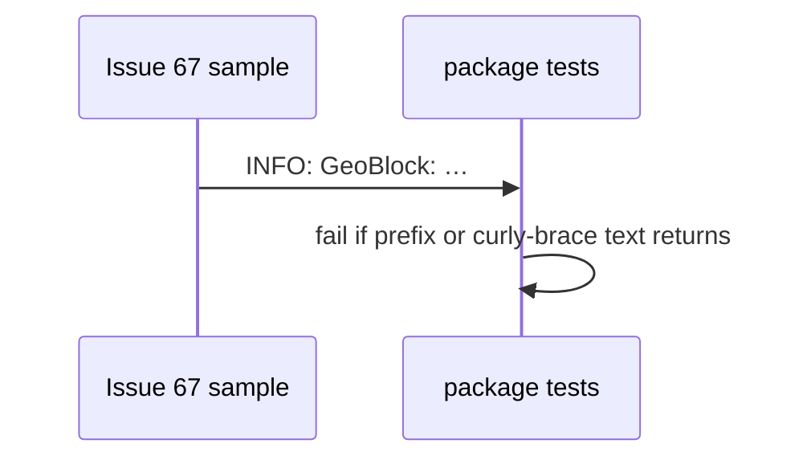

Developer review: in progress — 2026-09-08T12:52:59Z

IssueKey: 2026-09-08-non-json-logs
JobName: 2026-09-08-non-json-logs

Upstream: [PascalMinder/geoblock#67](https://github.com/PascalMinder/geoblock/issues/67)

## What this changes
**Operators.** None.

**Admin users.** None.

**Developers.** Package tests lock that stdout never uses the #67 `INFO: GeoBlock:` prefix, that default/text lines do not start with `{`, and that `logFormat: json` lines are JSON objects.

**End users.** None.

## Motivation
[PascalMinder/geoblock#67](https://github.com/PascalMinder/geoblock/issues/67) reported CrowdSec `UnmarshalJSON` failures on `INFO: GeoBlock:` lines. On `master` that prefix is already gone. DestBranch had no test that those shapes stay true. Without the lock, a logger edit can restore the prefix or emit a `{` line that is not JSON.

## Merge readiness
Seven-axis review done. No hard findings. CI succeeded. Archive and ready title remain.

Priority: P3 — DestBranch already lacks the filed prefix; this PR locks that with tests.
Reviewed head: 055929c
Owner decision: Required. See Decision needed.

## Review scores
| Measure | Result | What it means |
| --- | --- | --- |
| Overall readiness | 6/6 | CI green; no open review comments; local tests passed. |
| CI proof | 6/6 | Lint, Test, Integration Tests succeeded on [run 34228434330](https://github.com/david-garcia-garcia/traefik-geoblock/actions/runs/34228434330). |
| Local tests proof | N/A | Remote PR. `localTests: passed`. |
| Review resolution | 6/6 | No open PR review comments. |

## Verification
| Check | Result | Evidence |
| --- | --- | --- |
| Branch | 2026-09-08-non-json-logs pushed | git `055929c` |
| OpenSpec | crowdsec-compatible-stdout-logs | openspec/changes/crowdsec-compatible-stdout-logs/ |
| Pull request | https://github.com/david-garcia-garcia/traefik-geoblock/pull/81 | GitHub PR 81 |
| CI | build 34228434330 succeeded https://github.com/david-garcia-garcia/traefik-geoblock/actions/runs/34228434330 | GitHub check runs success |
| Local tests | passed | `go test ./... -count=1` |
| PR comments | no comments | comments: none |
| Upstream issue status comment | Set skipped | No write access to PascalMinder/geoblock#67 |

## Specs
- [core_geoblock_observability_decision-header](https://github.com/david-garcia-garcia/traefik-geoblock/blob/2026-09-08-non-json-logs/openspec/changes/crowdsec-compatible-stdout-logs/proposal.md) — modified

## Follow-up issues
- [ ] [Bootstrap and owner loggers ignore `logFormat`](https://github.com/david-garcia-garcia/traefik-geoblock/blob/2026-09-08-non-json-logs/knowledge/debt/2026-09-08-bootstrap-owner-logformat.md) — NewBootstrap and NewOwner always emit text even when logFormat is json.

## How this fits together
Upstream [PascalMinder/geoblock#67](https://github.com/PascalMinder/geoblock/issues/67) → PR 81 → tests + seven-axis review.

## Decision needed
| Question | Decision | By |
| --- | --- | --- |
| Should CreateConfig default `logFormat` become `json`? | assumed — no | explore |
| Must `NewBootstrap` / `NewOwner` honor `logFormat`? | assumed — not this run | explore |

## Before merge
- [ ] Archive change + drop WIP title

## Findings
None.

## Axis review
[Standards](https://github.com/david-garcia-garcia/traefik-geoblock/blob/2026-09-08-non-json-logs/devstate/2026/09/2026-09-08-non-json-logs/codereview_standards.md) — 4 total, 0 pending, 0 completed, 4 skipped
[Nitpicks](https://github.com/david-garcia-garcia/traefik-geoblock/blob/2026-09-08-non-json-logs/devstate/2026/09/2026-09-08-non-json-logs/codereview_nitpicks.md) — 0 total, 0 pending, 0 completed
[Spec](https://github.com/david-garcia-garcia/traefik-geoblock/blob/2026-09-08-non-json-logs/devstate/2026/09/2026-09-08-non-json-logs/codereview_spec.md) — 0 total, 0 pending, 0 completed
[Security](https://github.com/david-garcia-garcia/traefik-geoblock/blob/2026-09-08-non-json-logs/devstate/2026/09/2026-09-08-non-json-logs/codereview_security.md) — 0 total, 0 pending, 0 completed
[Performance](https://github.com/david-garcia-garcia/traefik-geoblock/blob/2026-09-08-non-json-logs/devstate/2026/09/2026-09-08-non-json-logs/codereview_performance.md) — 0 total, 0 pending, 0 completed
[Dead](https://github.com/david-garcia-garcia/traefik-geoblock/blob/2026-09-08-non-json-logs/devstate/2026/09/2026-09-08-non-json-logs/codereview_dead.md) — 0 total, 0 pending, 0 completed
[Test coverage](https://github.com/david-garcia-garcia/traefik-geoblock/blob/2026-09-08-non-json-logs/devstate/2026/09/2026-09-08-non-json-logs/codereview_coverage.md) — 0 total, 0 pending, 0 completed

## Agent review details

### Review metrics
| Metric | Value | Why it matters |
| --- | --- | --- |
| Specs in this PR | 0 added / 1 modified | Fold onto observability leaf |
| Open reviewer comments walked | 0 FIX / 0 ANSWER / 0 open | No review comments |
| Reviewed head | 055929c | After implement card |

### Stored data model
None.

### Technical review
Best possible solution: lock DestBranch line shapes with package tests.

Do we have a high-confidence way to reproduce? Yes — tests plus green CI.

Is this the best way to solve the issue? Yes — the filed bug is absent; the gap was proof.

### Evidence
What I checked:
- Pin `origin/master...HEAD` excluding `devstate/` and `.cursor/`
- Seven axis files written; 4 judgement Standards skipped
- CI run 34228434330 success

### Rank-up moves
None.
