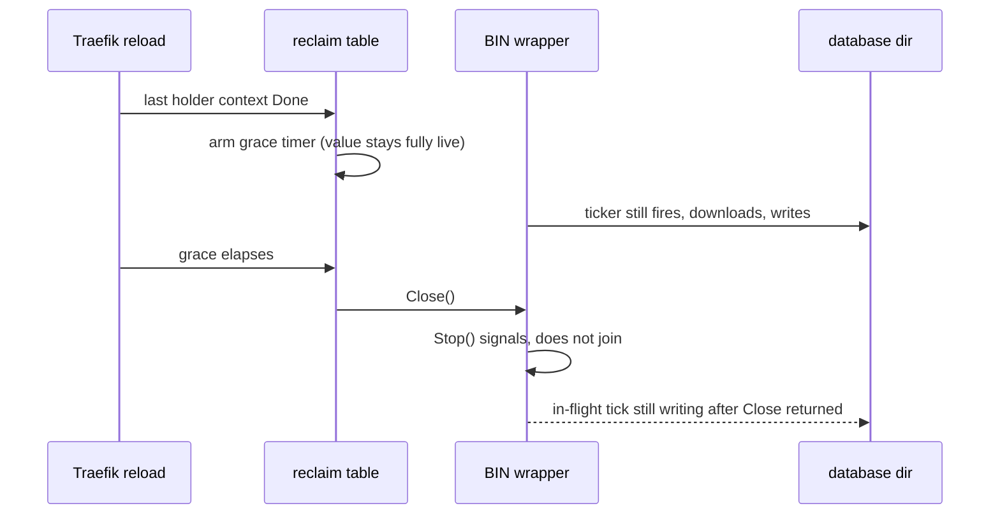

Developer review: ready for review — 2026-09-08T22:45:00Z

## What this changes

**Operators.** A failed database download no longer prints the source URL's query, so the ip2location and ipinfo tokens stop appearing in error logs; `databaseAutoUpdateDir` sources also stop fetching while no middleware instance holds them, and grace now means how long an idle database is kept rather than how long it stays fully live.

**Admin users.** None.

**Developers.** `pkg/reclaim` gives a stored value four events instead of two — `create -> (sleep -> wake)* -> sleep -> close`, with `sleeper` and `waker` joining `closer` as optional interfaces — and the slot drops its per-incarnation `context.WithCancel`, parked goroutine, `valueClosed` channel, and `arming` flag for an explicit four-state machine; `dbsource.Updater.Stop` now joins its loop and `Start` restarts it; `dbwrappers.BIN` and `MMDB` implement `Sleep`/`Wake` and `BIN` gains the mutex `MMDB` already had.

**End users.** None.

## Motivation

`pkg/reclaim` keeps one shared value per key — a GeoIP BIN or MMDB wrapper — alive while any Traefik middleware instance holds it, and for a grace window after the last holder goes away so a config reload does not re-download the database. On `master` the value only ever gets two events: it is created, and it is closed.

That makes the grace window expensive. When the last holder's context is Done the incarnation stays fully live: `dbsource.Updater` keeps its 24h ticker armed and the database file handle stays open for a resource nobody is using. Worse, `Updater.Stop` closes its stop channel and returns without joining the goroutine, and `tick` never checks that channel before downloading — so a wrapper the table already disposed can still write a database file into a directory a test's `TempDir` is deleting, which is a live source of flakes in `pkg/dbwrappers`. Two first `Open` calls for one key also both run `create`, which for a GeoIP source is a duplicated download and a second file open, and one of the two results is thrown away.

The structure made each of those hard to fix in place. `master` does not actually guarantee its two documented log invariants: `fire` logs `reclaim_dispose` right after `cancel()` rather than after `Close()` returns, and `drop` arms the grace timer before logging `reclaim_orphan`, so at a short grace dispose can precede orphan. The `arming` flag that exists to paper over the second one produced a stranded-incarnation bug in the prior hardening round: a slot left mapped with no holders, no timer, and a value never closed.

If this does not merge, the idle window stays expensive, the disposed-updater write stays a flake source, the two log guarantees stay documented but untrue, and the next state added to the table gets layered onto a per-slot lifetime context and parked goroutine that nothing outside the package can observe.

## Merge readiness

Implemented, reviewed on seven axes, archived, and green on all three CI jobs. 0 items remain.

Priority: P2 — real operator-visible waste plus a token written to logs on any download failure, both with limited blast radius.
Reviewed head: a4e95a8
Owner decision: Required. See Decision needed.

## Review scores
| Measure | Result | What it means |
| --- | --- | --- |
| Overall readiness | 6/6 | Change applied, reviewed, archived, and green on the measured head |
| CI proof | 6/6 | Test, Lint, and Integration Tests all succeeded — https://github.com/david-garcia-garcia/traefik-geoblock/actions/runs/34286439087 |
| Local tests proof | 6/6 | passed, including `pkg/reclaim -count=15` under 12 CPU burners at `GOMAXPROCS=2` |
| Review resolution | 6/6 | No open PR comments on #83 |

## Verification
| Check | Result | Evidence |
| --- | --- | --- |
| Branch | 2026-09-08-reclaim-lifecycle pushed | `git push origin` |
| OpenSpec | reclaim-value-sleep-wake-lifecycle, archived | `openspec validate --specs --strict` — 12 passed, 1 failed (`core_geoblock_database_token-download-file`, pre-existing from PR #60) |
| Pull request | https://github.com/david-garcia-garcia/traefik-geoblock/pull/83 | GitHub MCP |
| CI | run 34286439087 succeeded https://github.com/david-garcia-garcia/traefik-geoblock/actions/runs/34286439087 | GitHub MCP |
| Local tests | passed | handoff.yaml localTests |
| PR comments | no comments | devstate/comments.md absent |

## Specs
- [std_go_reclaim_value-lifecycle](https://github.com/david-garcia-garcia/traefik-geoblock/blob/2026-09-08-reclaim-lifecycle/openspec/changes/archive/2026-09-08-reclaim-value-sleep-wake-lifecycle/proposal.md) — added
- [std_go_reclaim_context-lease](https://github.com/david-garcia-garcia/traefik-geoblock/blob/2026-09-08-reclaim-lifecycle/openspec/changes/archive/2026-09-08-reclaim-value-sleep-wake-lifecycle/proposal.md) — modified
- [core_geoblock_database_wrapper-reclaim](https://github.com/david-garcia-garcia/traefik-geoblock/blob/2026-09-08-reclaim-lifecycle/openspec/changes/archive/2026-09-08-reclaim-value-sleep-wake-lifecycle/proposal.md) — modified
- [core_geoblock_database_url-download](https://github.com/david-garcia-garcia/traefik-geoblock/blob/2026-09-08-reclaim-lifecycle/openspec/changes/archive/2026-09-08-reclaim-value-sleep-wake-lifecycle/proposal.md) — modified

## Follow-up issues
- [ ] [Yaegi drops the method set of a value returned as `any`](https://github.com/david-garcia-garcia/traefik-geoblock/blob/2026-09-08-reclaim-lifecycle/knowledge/debt/2026-09-08-yaegi-drops-methods-on-any.md) — Yaegi strips the method set from a value returned through `func() (any, error)`, so the optional lifecycle never runs interpreted and this change's saving is real only for compiled callers.
- [ ] [Release the BIN and MMDB database handle on sleep](https://github.com/david-garcia-garcia/traefik-geoblock/blob/2026-09-08-reclaim-lifecycle/knowledge/debt/2026-09-08-release-wrapper-db-handle-on-sleep.md) — a sleeping wrapper still holds its database open, and releasing it needs a `Wake` failure policy the human has to decide.
- [ ] [Port the reclaim four-event lifecycle to traefik-modsecurity](https://github.com/david-garcia-garcia/traefik-geoblock/blob/2026-09-08-reclaim-lifecycle/knowledge/debt/2026-09-08-port-reclaim-lifecycle-to-modsecurity.md) — `pkg/reclaim` is a bidirectionally synced copy and this change is its first real behavioural divergence from `traefik-modsecurity`.
- [ ] [Make the database download cancelable](https://github.com/david-garcia-garcia/traefik-geoblock/blob/2026-09-08-reclaim-lifecycle/knowledge/debt/2026-09-08-cancelable-database-download.md) — `HTTPGet` is not cancelable, so a `Sleep` that lands during a download blocks an `Open` for as long as the transfer takes.

## How this fits together
The local ticket spec is at `devstate/2026/09/2026-09-08-reclaim-lifecycle/ticket/source.md`; branch `2026-09-08-reclaim-lifecycle` was cut from `origin/master` (`d10ad52`) into a dedicated worktree, PR #83 targets `master`, and CI ran on each push with the final head at `a4e95a8`.

## Decision needed
| Question | Decision | By |
| --- | --- | --- |
| Under Yaegi the optional lifecycle never runs, so `Sleep`, `Wake`, and `Close` are all inert in the deployed plugin. Reaching them needs `Open`'s signature to change in both this repo and `traefik-modsecurity`. Accept that for now? | assumed — yes. It is upstream behaviour, it predates this change (`closer` has never fired interpreted either), and the alternative moves a shared, byte-for-byte-synced API. Recorded as debt. | pullrequest |
| Does a sleep/wake reclaim already exist in another `david-garcia-garcia` repository? | resolved — no. A GitHub code search across the owner's repositories returned no `Sleep`/`Wake` reclaim implementation. | explore |
| Should `Sleep` also release the BIN/MMDB database handle, not only the updater? | assumed — no in v1. `Wake` must be infallible and a reopen can fail. Recorded as follow-up debt. | explore |
| Should `BIN` gain a mutex, since `hotSwap` already mutates `w.db` unguarded and sleep/wake adds a writer? | assumed — yes, one `sync.RWMutex` over `db`/`path`/`version`/`updater`, mirroring what `MMDB` already has. | explore |
| Must `Sleep` cancel the 10s delayed `oldDB.Close()` goroutine in `BIN.hotSwap`? | assumed — no. It holds a handle no caller can reach and joining it would block `Sleep` for ten seconds. | explore |
| PR #82 rewrites the same package and will conflict. Rebase onto it? | resolved — no. The human accepted the rework and the conflict, and told this run to branch from `origin/master` and read #82 as prior art only. | explore |
| PR #82's card records "do not delete the per-slot lifetime context and its goroutine". Is that reversed? | resolved — yes. The no-removal rule protects functionality, not unobservable plumbing; `life` is never handed to `create`. | explore |

## Before merge
- [x] Four-event lifecycle, table restructure, `Updater` join and restart, BIN + MMDB sleep/wake
- [x] Seven-axis code review on Opus: 18 found, 13 applied, 5 argued
- [x] Devdocs impact and OpenSpec archive; both spec-librarian validators exit 0
- [x] All three CI jobs green on `a4e95a8`

## Findings
- [[P1] Redaction helper panics under Yaegi and takes the Traefik process down](https://github.com/david-garcia-garcia/traefik-geoblock/blob/2026-09-08-reclaim-lifecycle/devstate/2026/09/2026-09-08-reclaim-lifecycle/yaegi.md) — FIX — the security fix ended in `parsed.RawQuery, parsed.Fragment, parsed.User = "", "", nil`, and a multi-assignment mixing an untyped nil into a pointer field panics interpreted, on the update goroutine, so every integration test failed at the API check; split one field per statement. Path: `pkg/dbsource/updater.go:144`. Reply none.
- [[P2] Optional-interface lookups used the one shape Yaegi panics on](https://github.com/david-garcia-garcia/traefik-geoblock/blob/2026-09-08-reclaim-lifecycle/knowledge/debt/2026-09-08-yaegi-drops-methods-on-any.md) — FIX — a comma-ok assertion to an interface panics under the interpreter for a value that reached `any` by being passed in; the three lookups became single-case type switches, which report no match instead of ending the process. Path: `pkg/reclaim/table.go:133`. Reply none.

## Axis review
[Standards](https://github.com/david-garcia-garcia/traefik-geoblock/blob/2026-09-08-reclaim-lifecycle/devstate/2026/09/2026-09-08-reclaim-lifecycle/codereview_standards.md) — 4 total, 0 pending, 3 completed, 1 skipped
[Nitpicks](https://github.com/david-garcia-garcia/traefik-geoblock/blob/2026-09-08-reclaim-lifecycle/devstate/2026/09/2026-09-08-reclaim-lifecycle/codereview_nitpicks.md) — 4 total, 0 pending, 4 completed
[Spec](https://github.com/david-garcia-garcia/traefik-geoblock/blob/2026-09-08-reclaim-lifecycle/devstate/2026/09/2026-09-08-reclaim-lifecycle/codereview_spec.md) — 2 total, 0 pending, 2 completed
[Security](https://github.com/david-garcia-garcia/traefik-geoblock/blob/2026-09-08-reclaim-lifecycle/devstate/2026/09/2026-09-08-reclaim-lifecycle/codereview_security.md) — 2 total, 0 pending, 1 completed, 1 skipped
[Performance](https://github.com/david-garcia-garcia/traefik-geoblock/blob/2026-09-08-reclaim-lifecycle/devstate/2026/09/2026-09-08-reclaim-lifecycle/codereview_performance.md) — 3 total, 0 pending, 0 completed, 3 skipped
[Dead](https://github.com/david-garcia-garcia/traefik-geoblock/blob/2026-09-08-reclaim-lifecycle/devstate/2026/09/2026-09-08-reclaim-lifecycle/codereview_dead.md) — 1 total, 0 pending, 1 completed
[Test coverage](https://github.com/david-garcia-garcia/traefik-geoblock/blob/2026-09-08-reclaim-lifecycle/devstate/2026/09/2026-09-08-reclaim-lifecycle/codereview_coverage.md) — 2 total, 0 pending, 2 completed

## Agent review details

### Review metrics
| Metric | Value | Why it matters |
| --- | --- | --- |
| Specs in this PR | 1 added / 3 modified | Same list as ## Specs |
| Open reviewer comments walked | 0 FIX / 0 ANSWER / 0 open | Unanswered review is merge risk |
| Reviewed head | a4e95a89e18a1f85eeca36b476d975c2be21697f | Card must match the branch you measured |

### Stored data model
None.

### Technical review
Best possible solution: Keep the table mutex, register the key in a busy state before `create` so a second caller waits rather than duplicating a download, and give the goroutine that sees the last holder go Done the whole rest of the incarnation — sleep, orphan line, grace wait, close, dispose line — which makes both log guarantees structural instead of flag-driven.

Do we have a high-confidence way to reproduce? Yes, three ways. CPU contention plus `-count=15` reproduces this package's flakes locally (`-race` needs cgo, which this box has no toolchain for); signature-preserving mutations in a scratch module prove each new test can fail; and a Yaegi harness outside the repo runs the real packages the way Traefik loads them, which is what found the integration failure.

Is this the best way to solve the issue? Yes for the shape, with a measurement: a per-key owner goroutine does **not** remove the lost-create race, it moves it.

### Evidence
What I checked:
- Owner-goroutine probe, `go run .` in a scratch module: eight racing first `Open`s ran `create` exactly once in all three shapes, so registering the key before `create` is what removes the duplicate download — not the goroutine.
- Same probe: an `Open` that takes an owner handle under the table mutex and sends after releasing it was stranded **203 times out of 1600** against an owner that deregisters itself and exits; a `pending` reservation counter under the same mutex took that to **0**.
- Mutation testing, `devstate/.../mutations.md`: each new guarantee was removed one at a time and the named test failed each time, including dispose-after-`Close()` and orphan-before-dispose.
- Yaegi harness at v0.16.1, the version Traefik v3.7.11 pins: the plugin's `New` resolves, the multi-assignment panics, one assignment per field does not, and the optional interfaces never match on `origin/master` either.
- `pkg/reclaim -count=15` and `pkg/dbsource pkg/dbwrappers -count=5` under 12 background CPU burners at `GOMAXPROCS=2`: all green.
- Both spec-librarian validators exit 0; `openspec validate --specs --strict` fails only on `core_geoblock_database_token-download-file`, pre-existing from PR #60.

### Rank-up moves
- Add a CI step that builds a throwaway module outside this one, depends on the Yaegi version Traefik pins, and evaluates the plugin from a `plugins-local` GoPath — the only cheap guard against interpreted-only defects, which `go test` cannot see and which cost this run its longest detour.
