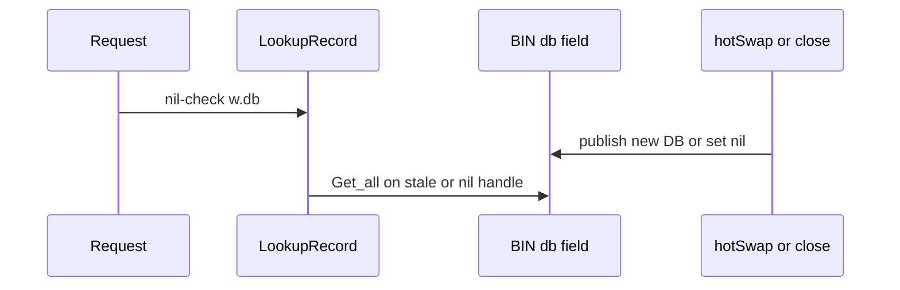

Developer review: in progress — 2026-09-14T21:16:19Z

## What this changes
**Operators.** None.

**Admin users.** None.

**Developers.** No BIN mutex yet versus `master`. This branch parks `knowledge/debt/2026-09-14-ci-go-race-detector.md` so CI `-race` stays a follow-up.

**End users.** None.

## Motivation
IP2Location BIN wrappers serve country data on the request path while an updater tick and reclaim Close publish or clear the live file handle. MaxMind MMDB already locks that job. BIN does not.

On `master`, `LookupRecord` reads `w.db` twice with no mutex while `hotSwap` and `close` write it. The race detector fails `TestNew_ContextBindsWrapper` and `TestOpenBIN_HashChangeDisposesOld`. A dispose between those two reads calls `Get_all` on a nil `*ip2loc.DB`, which panics in `query` on `d.metaok`.

Not merging leaves every BIN-backed middleware deciding allow/block from unsynchronized handle memory, plus a panic window in Traefik's handler chain.

## Merge readiness
Prepare is grounded and the stub PR is open. Product mutex work has not started. 2 items remain.

Priority: P1 — Production is unsafe, or serving a wrong public contract today
Reviewed head: 1b40453
Owner decision: None.

## Review scores
| Measure | Result | What it means |
| --- | --- | --- |
| Overall readiness | 3/6 | CI is in progress; product fix is not on the branch yet |
| CI proof | 3/6 | Checks in progress on run 34897837509 |
| Local tests proof | N/A | Before implement on a remote PR |
| Review resolution | 6/6 | OPEN PR, no review comments |

## Verification
| Check | Result | Evidence |
| --- | --- | --- |
| Branch | 2026-09-14-bin-handle-race pushed | `git` origin/2026-09-14-bin-handle-race |
| OpenSpec | none | `openspec/` |
| Pull request | https://github.com/david-garcia-garcia/traefik-geoblock/pull/85 | pr-host List/Create |
| CI | build 34897837509 in progress https://github.com/david-garcia-garcia/traefik-geoblock/actions/runs/34897837509 | pr-host CI |
| Local tests | none | handoff.yaml localTests |
| PR comments | no comments | no comments.md |

## Specs
None.

## Deviations from the ask
None.

## Follow-up issues
- [ ] [Enable the Go race detector in CI](https://github.com/david-garcia-garcia/traefik-geoblock/blob/2026-09-14-bin-handle-race/knowledge/debt/2026-09-14-ci-go-race-detector.md) — adding `-race` to CI is not a one-line flag that already works; logging tests race and Yaegi skips.

## How this fits together
Local dump for F-1/F-1b is grounded on `2026-09-14-bin-handle-race`, stub PR 85 is open, and CI has started. Explore is next.

## Explore Decisions
None.

## Before merge
- [ ] [P1] Guard `BIN.db` with MMDB-matching `RWMutex` discipline; `LookupRecord` takes the handle once
- [ ] [P1] Existing `-race` failures must pass; add product concurrency tests (do not copy `zzz_proof_*`)
- [x] Stub PR opened

## Findings
None.

## Axis review
None.

## Agent review details

### Review metrics
| Metric | Value | Why it matters |
| --- | --- | --- |
| Specs in this PR | none | Same list as ## Specs; do not paste diff --stat |
| Open reviewer comments walked | 0 FIX / 0 ANSWER / 0 open | Unanswered review is merge risk |
| Reviewed head | 1b404535a5b6a4d4bddf27265d0cbccac5443b59 | Card must match the branch you measured |

### Stored data model
None.

### Technical review
Best possible solution: match MMDB's existing `sync.RWMutex` publish/lookup/close path on BIN; do not invent a second locking model.

Do we have a high-confidence way to reproduce? Yes, `go test -race` on `TestNew_ContextBindsWrapper` and `TestOpenBIN_HashChangeDisposesOld` (docker `golang:1.25` with `GOFLAGS=-mod=vendor` when the host has no gcc).

Is this the best way to solve the issue? Yes versus `master`: MMDB already owns this discipline.

### Evidence
What I checked:
- `BIN` has no mutex; `hotSwap`/`close` write `w.db`; `LookupRecord` reads it twice (`pkg/dbwrappers/bin.go`, origin/master 7639e7b)
- `MMDB` locks via `swapReader` and `Lookup` (`pkg/dbwrappers/mmdb.go`)
- `Get_all` → `query` reads `d.metaok` with no nil-receiver guard (`vendor/github.com/ip2location/ip2location-go/v9/ip2location.go`)
- CI test step is `go test -v ./...` (`.github/workflows/ci.yml`); logging tests race under `-race`
- Stub PR 85 created; check runs in progress (run 34897837509)

### Rank-up moves
None.
