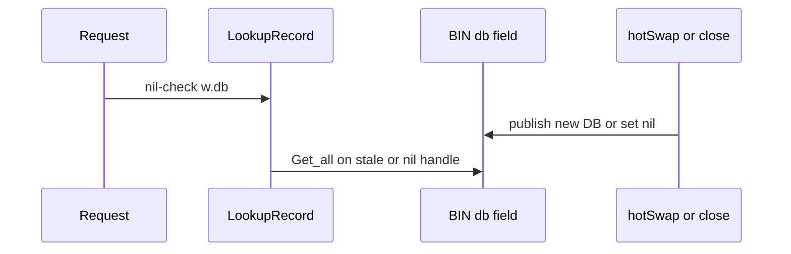

Developer review: in progress — 2026-09-14T21:53:56Z

## What this changes
**Operators.** None.

**Admin users.** None.

**Developers.** `BIN` now serializes the published handle with `sync.RWMutex` and `swapHandle`. `LookupRecord` holds `RLock` for the nil check and one `Get_all`. Concurrent lookup vs hot-swap/close tests live in `pkg/dbwrappers/bin_handle_test.go`. OpenSpec change `bin-rwmutex-published-handle` folds those rules onto `core_geoblock_database_wrapper-reclaim` and `core_geoblock_database_lookup`. Usage packet `knowledge/devdocs/core_geoblock_database_wrapper.md` notes the RWMutex / Yaegi-defer gotcha. CI `-race` stays a follow-up via `knowledge/debt/2026-09-14-ci-go-race-detector.md`.

**End users.** BIN-backed allow/block no longer races a torn handle or panics on a nil Get_all during reclaim or hot-swap.

## Motivation
IP2Location BIN wrappers serve country data on the request path while an updater tick and reclaim Close publish or clear the live file handle. MaxMind MMDB already locks that job. BIN does not.

On `master`, `LookupRecord` reads `w.db` twice with no mutex while `hotSwap` and `close` write it. Explore reproduced both race-detector failures (`TestNew_ContextBindsWrapper`, `TestOpenBIN_HashChangeDisposesOld`) under docker `golang:1.25` with `GOFLAGS=-mod=vendor`. A dispose between those two reads calls `Get_all` on a nil `*ip2loc.DB`, which panics in `query` on `d.metaok`.

Not merging leaves every BIN-backed middleware deciding allow/block from unsynchronized handle memory, plus a panic window in Traefik's handler chain.

## Merge readiness
Seven-axis review applied two hard nits. CI on the review-fix push is still in progress. 1 item remains.

Priority: P1 — Production is unsafe, or serving a wrong public contract today
Reviewed head: 14dee85
Owner decision: Required. See Explore Decisions.

## Review scores
| Measure | Result | What it means |
| --- | --- | --- |
| Overall readiness | 3/6 | CI in progress after review-fix push |
| CI proof | 3/6 | Lint, Test, and Integration Tests in progress on run 34901269836 |
| Local tests proof | N/A | Remote PR; CI proof covers it (handoff localTests: passed) |
| Review resolution | 6/6 | OPEN PR, no review comments |

## Verification
| Check | Result | Evidence |
| --- | --- | --- |
| Branch | 2026-09-14-bin-handle-race pushed | `git` origin/2026-09-14-bin-handle-race |
| OpenSpec | bin-rwmutex-published-handle | `openspec/changes/bin-rwmutex-published-handle/` |
| Pull request | https://github.com/david-garcia-garcia/traefik-geoblock/pull/85 | pr-host List |
| CI | build 34901269836 in progress https://github.com/david-garcia-garcia/traefik-geoblock/actions/runs/34901269836 | pr-host CI |
| Local tests | passed | handoff.yaml localTests |
| PR comments | no comments | no comments.md |

## Specs
- [core_geoblock_database_wrapper-reclaim](https://github.com/david-garcia-garcia/traefik-geoblock/blob/2026-09-14-bin-handle-race/openspec/changes/bin-rwmutex-published-handle/proposal.md) — modified
- [core_geoblock_database_lookup](https://github.com/david-garcia-garcia/traefik-geoblock/blob/2026-09-14-bin-handle-race/openspec/changes/bin-rwmutex-published-handle/proposal.md) — modified

## Deviations from the ask
- taken: BIN mutex discipline matching MMDB → keep BIN 10s delayed Close after swap — `pkg/dbwrappers/bin.go` — mutex already waits in-flight Get_all; the 10s delay is existing BIN behavior and no criterion names it. Requester: not asked.

## Follow-up issues
- [ ] [Enable the Go race detector in CI](https://github.com/david-garcia-garcia/traefik-geoblock/blob/2026-09-14-bin-handle-race/knowledge/debt/2026-09-14-ci-go-race-detector.md) — adding `-race` to CI is not a one-line flag that already works; logging tests race and Yaegi skips.

## How this fits together
Local dump is grounded on `2026-09-14-bin-handle-race`, stub PR 85 is open, the BIN mutex has landed, and seven-axis review applied two nits. Devdocs impact is next.

## Explore Decisions
| Question | Rank | Decision | By |
| --- | --- | --- | --- |
| Does LookupRecord hold RLock for Get_all, or snapshot *ip2loc.DB and unlock first? | bounded asked | assumed — RLock for nil-check + Get_all (defer RUnlock, Yaegi), then map columns. Do not snapshot-and-unlock. | propose |
| What publishes the BIN handle — swapHandle, swapReader, or a helper shared with MMDB? | additive asked | assumed — BIN-local swapHandle with MMDB.swapReader shape. Do not name it swapReader. Do not extract a shared helper; leave mmdb.go unchanged. | propose |
| Do Path / Version / SourcePath take the same mutex as db? | bounded asked | assumed — yes. RLock on those getters; startUpdate compares via SourcePath(). | propose |
| After swapHandle, does BIN still delay-Close the old handle by 10s, or Close immediately like MMDB? | bounded incidental | assumed — keep the 10s delayed Close of the old handle. Do not reshape hot-swap timing to match MMDB. | propose |
| Where do the new concurrent lookup vs hot-swap/close tests live? | additive asked | assumed — add package tests in pkg/dbwrappers (not zzz_proof_*, not pkg/geoblock). Keep the two existing lifecycle tests as the race-detector gate. | propose |
| Add go test -race to CI / Makefile in this change? | additive incidental | assumed — do not add the flag. Follow-up remains knowledge/debt/2026-09-14-ci-go-race-detector.md. | propose |

## Before merge
- [ ] Owner review of assumed Explore Decisions (mutex shape, 10s Close, no CI `-race`)
- [x] Guard `BIN.db` with MMDB-matching `RWMutex` discipline; `LookupRecord` takes the handle once
- [x] Existing `-race` failures must pass; add product concurrency tests (do not copy `zzz_proof_*`)
- [x] Seven-axis review: two hard nits applied (04190b9)
- [x] Stub PR opened
- [x] OpenSpec change `bin-rwmutex-published-handle` proposed

## Findings
- [[P3] startUpdate job comment](https://github.com/david-garcia-garcia/traefik-geoblock/blob/2026-09-14-bin-handle-race/devstate/2026/09/2026-09-14-bin-handle-race/codereview_standards.md) — FIX — applied. Path: `pkg/dbwrappers/bin.go`. Reply none.
- [[P3] hotSwap previous-handle name](https://github.com/david-garcia-garcia/traefik-geoblock/blob/2026-09-14-bin-handle-race/devstate/2026/09/2026-09-14-bin-handle-race/codereview_nitpicks.md) — FIX — applied (`oldDB` → `old`). Path: `pkg/dbwrappers/bin.go`. Reply none.

## Axis review
[Standards](https://github.com/david-garcia-garcia/traefik-geoblock/blob/2026-09-14-bin-handle-race/devstate/2026/09/2026-09-14-bin-handle-race/codereview_standards.md) — 1 total, 0 pending, 1 completed
[Nitpicks](https://github.com/david-garcia-garcia/traefik-geoblock/blob/2026-09-14-bin-handle-race/devstate/2026/09/2026-09-14-bin-handle-race/codereview_nitpicks.md) — 1 total, 0 pending, 1 completed
[Spec](https://github.com/david-garcia-garcia/traefik-geoblock/blob/2026-09-14-bin-handle-race/devstate/2026/09/2026-09-14-bin-handle-race/codereview_spec.md) — 0 total, 0 pending, 0 completed
[Security](https://github.com/david-garcia-garcia/traefik-geoblock/blob/2026-09-14-bin-handle-race/devstate/2026/09/2026-09-14-bin-handle-race/codereview_security.md) — 0 total, 0 pending, 0 completed
[Performance](https://github.com/david-garcia-garcia/traefik-geoblock/blob/2026-09-14-bin-handle-race/devstate/2026/09/2026-09-14-bin-handle-race/codereview_performance.md) — 0 total, 0 pending, 0 completed
[Dead](https://github.com/david-garcia-garcia/traefik-geoblock/blob/2026-09-14-bin-handle-race/devstate/2026/09/2026-09-14-bin-handle-race/codereview_dead.md) — 0 total, 0 pending, 0 completed
[Test coverage](https://github.com/david-garcia-garcia/traefik-geoblock/blob/2026-09-14-bin-handle-race/devstate/2026/09/2026-09-14-bin-handle-race/codereview_coverage.md) — 0 total, 0 pending, 0 completed

## Agent review details

### Review metrics
| Metric | Value | Why it matters |
| --- | --- | --- |
| Specs in this PR | 0 added / 2 modified | Same list as ## Specs; do not paste diff --stat |
| Open reviewer comments walked | 0 FIX / 0 ANSWER / 0 open | Unanswered review is merge risk |
| Reviewed head | 14dee85c9b3c05c20ab7e405883fc9a2a56a7939 | Card must match the branch you measured |

### Stored data model
None.

### Technical review
Best possible solution: match MMDB's existing `sync.RWMutex` publish/lookup/close path on BIN; do not invent a second locking model.

Do we have a high-confidence way to reproduce? Yes, `go test -race` on `TestNew_ContextBindsWrapper` and `TestOpenBIN_HashChangeDisposesOld` (docker `golang:1.25` with `GOFLAGS=-mod=vendor` when the host has no gcc).

Is this the best way to solve the issue? Yes versus `master`: MMDB already owns this discipline. BIN-local `swapHandle`; leave `mmdb.go` unchanged.

### Evidence
What I checked:
- Seven axis files under the run root; Standards 1 done, Nitpicks 1 done, other axes none
- Review-fix SHA 04190b9
- CI in progress on run 34901269836 (HEAD 14dee85)

### Rank-up moves
None.
