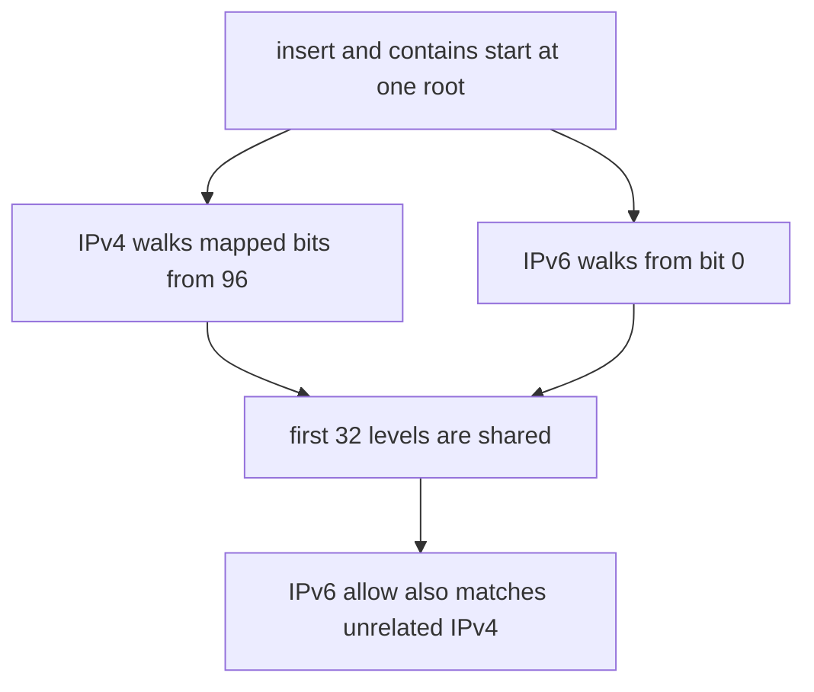

Developer review: needs changes — 2026-09-14T21:46:21.149Z

## What this changes
**Operators.** A CIDR in `allowedIPBlocks` / `blockedIPBlocks` (and the matching directory lists) matches only the address family it was written for; list both families when both should match.

**Admin users.** None.

**Developers.** `IpLookupHelper` stores IPv4 and IPv6 on separate trees; `AddCIDR` / `IsContained` still classify with `ip.To4() != nil`. Product tests cover colliding prefixes (`1.2.3.4/32` vs `102:304::1`, `808:808::/32` vs `8.8.8.8`) and a request-path IPv6 allow vs blocked-country IPv4.

**End users.** An IPv6 office allow-list no longer lets colliding IPv4 through as `pass:allowed_ip_block`; the mirror case no longer blocks innocent IPv4.

## Motivation
CIDR allow and deny live on `IpLookupHelper` and are applied in `decide`. On master those lists share one radix root: IPv4 walks mapped bits from 96, IPv6 walks from bit 0, and the first 32 levels are the same path.

An IPv4 `1.2.3.4/32` therefore also matches IPv6 `102:304::1`, and an IPv6 `808:808::/32` also matches IPv4 `8.8.8.8`. An operator who allow-lists an IPv6 office prefix silently allow-lists unrelated IPv4. Not merging leaves that hole in the public CIDR contract.

## Merge readiness
Family isolation landed on the helper. CI Test failed on this head. 1 item remains.

Priority: P1 — Production is serving a wrong public contract today
Reviewed head: 108264b
Owner decision: Required. See Explore Decisions.

## Review scores
| Measure | Result | What it means |
| --- | --- | --- |
| Overall readiness | 2/6 | CI Test failed |
| CI proof | 2/6 | Test failed, Lint and Integration Tests succeeded https://github.com/david-garcia-garcia/traefik-geoblock/actions/runs/34900132878 |
| Local tests proof | N/A | Remote PR — CI covers this |
| Review resolution | 6/6 | OPEN PR, no review comments |

## Verification
| Check | Result | Evidence |
| --- | --- | --- |
| Branch | 2026-09-14-cidr-family-leak pushed | git / GitHub |
| OpenSpec | cidr-family-isolation | `openspec/` |
| Pull request | https://github.com/david-garcia-garcia/traefik-geoblock/pull/86 | GitHub |
| CI | build 34900132878 failure https://github.com/david-garcia-garcia/traefik-geoblock/actions/runs/34900132878 | GitHub checks |
| Local tests | passed | handoff.yaml localTests |
| PR comments | no comments | inventory empty |

## Specs
- [core_geoblock_iplookup_family-match](https://github.com/david-garcia-garcia/traefik-geoblock/blob/2026-09-14-cidr-family-leak/openspec/changes/cidr-family-isolation/proposal.md) — added

## Deviations from the ask
None.

## Follow-up issues
- [ ] [`decide` `/0` sentinel vs longest-prefix](https://github.com/david-garcia-garcia/traefik-geoblock/blob/2026-09-14-cidr-family-leak/knowledge/debt/2026-09-14-decide-slash-zero-sentinel.md) — `decide` treats `/0` as a sentinel so a catch-all allow beats a more specific block.

## How this fits together
Local ticket 2026-09-14-cidr-family-leak is on branch `2026-09-14-cidr-family-leak` and PR 86. Implement split the CIDR helper onto family trees. Local `go test ./...` passed; CI Test on this head failed.

## Explore Decisions
| Question | Rank | Decision | By |
| --- | --- | --- | --- |
| Two internal trees or a family discriminator on the shared endpoint? | additive asked | assumed — two internal trees. A discriminator must special-case the shared root so `0.0.0.0/0` and `::/0` do not overwrite one endpoint; two trees reuse the existing `To4()` branch and leave `ipRadixTree` family-agnostic. | propose |
| Is a found/length split in `contains` required to keep current `/0` tests passing after family isolation? | additive asked | assumed — no split and no `decide` edit. Two family trees return `(true, 0)` for a same-family `/0` and `false` for the other family. EdgeCases and PrefixLengthAccuracy stay valid without an API change. | propose |
| How should IPv4-mapped IPv6 CIDRs and lookups (`::ffff:a.b.c.d`) be classified? | additive incidental | assumed — keep `To4() != nil` as IPv4. Do not add a third family or a plugin-level mapped check. | propose |

## Before merge
- [x] Keep CIDR allow and deny matching only the address family the rule was written for [P1]
- [ ] Green CI Test on this head [P1]

## Findings
None.

## Axis review
None.

## Agent review details

### Review metrics
| Metric | Value | Why it matters |
| --- | --- | --- |
| Specs in this PR | 1 added / 0 modified | Same list as ## Specs |
| Open reviewer comments walked | 0 FIX / 0 ANSWER / 0 open | Unanswered review is merge risk |
| Reviewed head | 108264bfe1cf3432843cc9abc906dcd07931d920 | Card must match the branch you measured |

### Stored data model
None.

### Technical review
Best possible solution: two internal trees on `IpLookupHelper` so a CIDR cannot match the other family, without tagging `radixNode` or editing `decide`.

Do we have a high-confidence way to reproduce? Yes, colliding prefixes `1.2.3.4/32` vs `102:304::1` and `808:808::/32` vs `8.8.8.8`, plus the request-path IPv6 allow vs blocked-country IPv4.

Is this the best way to solve the issue? Yes — insert and contains already branch on `To4()`, and two trees isolate `/0` without a found/length API split.

### Evidence
What I checked:
- `pkg/iplookup/iplookup.go` `IpLookupHelper` now has `ipv4Tree` / `ipv6Tree` (path, 108264b)
- `go test ./...` passed locally; `golang:1.21` docker `go test ./...` passed
- `decide` in `pkg/geoblock/plugin.go` was not edited
- OPEN PR 86, comment inventory empty
- CI run 34900132878: Lint success, Test failure, Integration Tests success https://github.com/david-garcia-garcia/traefik-geoblock/actions/runs/34900132878

### Rank-up moves
- Read the Test job log (sign-in required) and rerun if the fail is a runner flake; docker Go 1.21 on this tree was green.
