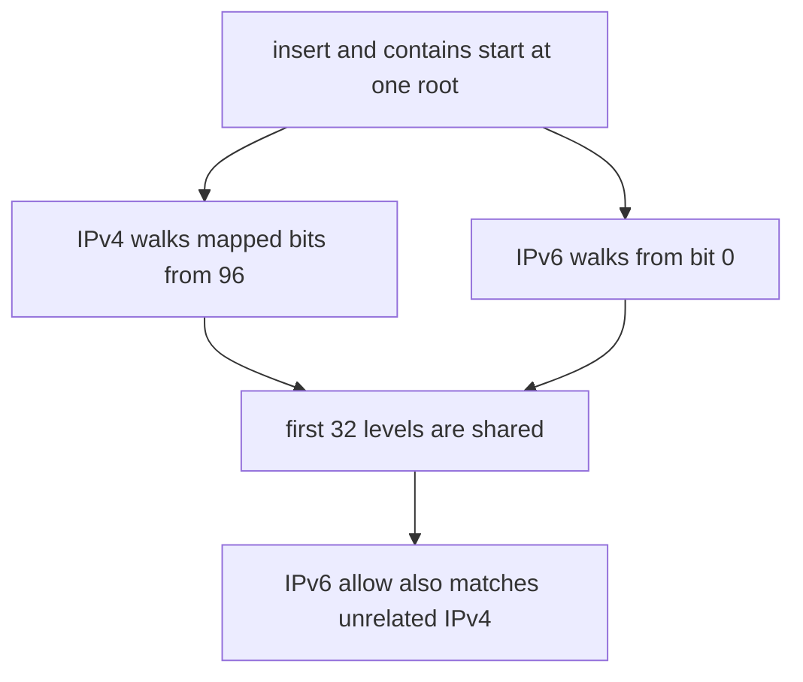

Developer review: in progress — 2026-09-14T21:17:17.965Z

## What this changes
**Operators.** None.

**Admin users.** None.

**Developers.** None.

**End users.** None.

## Motivation
`allowedIPBlocks` and `blockedIPBlocks` are stored in `pkg/iplookup` and applied in `pkg/geoblock` `decide`. On master those lists live on one radix path: IPv4 prefixes are walked from bit 96 of the mapped form but inserted from the root, where IPv6 prefixes start.

An IPv4 `1.2.3.4/32` therefore also matches IPv6 `102:304::1`, and an IPv6 `808:808::/32` also matches IPv4 `8.8.8.8`. An operator who allow-lists an IPv6 office prefix silently allow-lists unrelated IPv4 — a country-blocked client walks through as `pass:allowed_ip_block`. The mirror case blocks innocent traffic. Not merging leaves that hole in the public CIDR contract.

## Merge readiness
Prepare grounded the leak. Product code is unchanged versus master. 1 item remains.

Priority: P1 — Production is serving a wrong public contract today
Reviewed head: aa02225
Owner decision: None.

## Review scores
| Measure | Result | What it means |
| --- | --- | --- |
| Overall readiness | 3/6 | CI still running on the prepare commit |
| CI proof | 3/6 | build 34897940802 in progress https://github.com/david-garcia-garcia/traefik-geoblock/actions/runs/34897940802 |
| Local tests proof | N/A | Remote PR — CI covers this |
| Review resolution | 6/6 | OPEN PR, no review comments |

## Verification
| Check | Result | Evidence |
| --- | --- | --- |
| Branch | 2026-09-14-cidr-family-leak pushed | git / GitHub |
| OpenSpec | none | `openspec/` |
| Pull request | https://github.com/david-garcia-garcia/traefik-geoblock/pull/86 | GitHub |
| CI | build 34897940802 in progress https://github.com/david-garcia-garcia/traefik-geoblock/actions/runs/34897940802 | GitHub checks |
| Local tests | none | handoff.yaml localTests |
| PR comments | no comments | inventory empty |

## Specs
None.

## Deviations from the ask
None.

## Follow-up issues
None.

## How this fits together
Local ticket 2026-09-14-cidr-family-leak is on branch `2026-09-14-cidr-family-leak` and PR 86. Prepare qualified-with-gaps. CI is in progress. Explore is next.

## Explore Decisions
None.

## Before merge
- [ ] Keep CIDR allow and deny matching only the address family the rule was written for [P1]

## Findings
None.

## Axis review
None.

## Agent review details

### Review metrics
| Metric | Value | Why it matters |
| --- | --- | --- |
| Specs in this PR | none | Same list as ## Specs |
| Open reviewer comments walked | 0 FIX / 0 ANSWER / 0 open | Unanswered review is merge risk |
| Reviewed head | aa022256d143b26a13c5116c8a3a2c5850896f86 | Card must match the branch you measured |

### Stored data model
None.

### Technical review
Best possible solution: not applied yet — prepare only, dest still mixes families on one radix path.

Do we have a high-confidence way to reproduce? Yes, colliding prefixes `1.2.3.4/32` vs `102:304::1` and `808:808::/32` vs `8.8.8.8`, plus the request-path IPv6 allow vs blocked-country IPv4.

Is this the best way to solve the issue? Not chosen yet. Explore picks two trees vs a family discriminator on the existing helper.

### Evidence
What I checked:
- dest `pkg/iplookup/iplookup.go` `insert` / `contains` share `tree.root` (path, aa02225)
- mixed-family test uses non-colliding prefixes (`pkg/iplookup/iplookup_test.go`)
- `decide` consumes `IsContained` with no family check (`pkg/geoblock/plugin.go`)
- OPEN PR 86, comment inventory empty
- CI run 34897940802 queued / in progress

### Rank-up moves
None.
