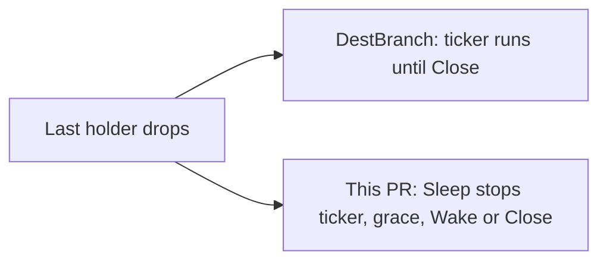

Developer review: ready for review — 2026-09-14T18:26:39.723Z

## What this changes
**Operators.** None.

**Admin users.** None.

**Developers.** `pkg/reclaim` is now the v1.0.1 Hooks table (Sleep, Wake, Close). BIN and MMDB stop and restart the 24h keep-current ticker on Sleep/Wake. Plugin and wrappers each own a `New(Config)` table. Process `Default` is gone.

**End users.** None.

## Motivation
On DestBranch, plugin instances and geo catalog wrappers live in a local reclaim table that discovers `Close()` on the stored value. Yaegi synthesizes create returns with no methods, so that discovery does not run under Traefik. The download ticker kept running after the last holder dropped, through grace, until Close. The utilities table parks the value asleep and calls explicit Hooks, so idle work can stop until reclaim or dispose.

If we do not merge, Traefik reloads keep a Close-only fork and catalog updaters keep ticking while nobody holds the file.

## Merge readiness
Product import landed and CI succeeded. 0 items remain.

Priority: P3 — spec and internal table copy, no current user or operator harm
Reviewed head: 5b0e883
Owner decision: Required. See Explore Decisions.

## Review scores
| Measure | Result | What it means |
| --- | --- | --- |
| Overall readiness | 6/6 | CI succeeded and there are no open PR comments |
| CI proof | 6/6 | Lint, Test, and Integration Tests succeeded |
| Local tests proof | N/A | Remote PR; CI covers it (`go test ./...` passed locally) |
| Review resolution | 6/6 | No open PR comments |

## Verification
| Check | Result | Evidence |
| --- | --- | --- |
| Branch | 2026-09-14-import-reclaim-table pushed | `git` tracking origin |
| OpenSpec | import-reclaim-table archived | `openspec/changes/archive/2026-09-14-import-reclaim-table/` |
| Pull request | https://github.com/david-garcia-garcia/traefik-geoblock/pull/84 | pr-host |
| CI | build 34880545779 succeeded https://github.com/david-garcia-garcia/traefik-geoblock/actions/runs/34880545779 | GitHub check runs |
| Local tests | passed | handoff.yaml localTests |
| PR comments | no comments | pull_request_read |

## Specs
- [std_go_reclaim_value-lifecycle](https://github.com/david-garcia-garcia/traefik-geoblock/blob/2026-09-14-import-reclaim-table/openspec/changes/archive/2026-09-14-import-reclaim-table/proposal.md) — added
- [std_go_reclaim_context-lease](https://github.com/david-garcia-garcia/traefik-geoblock/blob/2026-09-14-import-reclaim-table/openspec/changes/archive/2026-09-14-import-reclaim-table/proposal.md) — modified
- [core_geoblock_plugin_instance-reclaim](https://github.com/david-garcia-garcia/traefik-geoblock/blob/2026-09-14-import-reclaim-table/openspec/changes/archive/2026-09-14-import-reclaim-table/proposal.md) — modified
- [core_geoblock_database_wrapper-reclaim](https://github.com/david-garcia-garcia/traefik-geoblock/blob/2026-09-14-import-reclaim-table/openspec/changes/archive/2026-09-14-import-reclaim-table/proposal.md) — modified

## Deviations from the ask
None.

## Follow-up issues
None.

## How this fits together
Local ticket on branch `2026-09-14-import-reclaim-table`, PR 84, CI green on 5b0e883.

## Explore Decisions
| Question | Rank | Decision | By |
| --- | --- | --- | --- |
| Copy v1.0.1 into `pkg/reclaim`, or `go.mod` require `github.com/david-garcia-garcia/traefik-middleware-utilities/reclaim`? | structural asked | assumed — copy the pinned v1.0.1 sources into `pkg/reclaim`. Do not add a module require. | explore |
| After Default goes away, who holds the `*Table`, and how do tests that call `dbwrappers.Reset` / `ResetWith` still tear down plugin and wrapper incarnations? | bounded asked | assumed — plugin root holds one table; `pkg/dbwrappers` holds one table. Plugin tests that called `dbwrappers.Reset` for `plugin:` keys must also Reset the plugin-root table. | explore |
| Should any caller set `Hooks.EnforceCloseBeforeOpen`? | additive asked | assumed — false for Plugin, BIN, and MMDB (remote default). | explore |

## Before merge
None.

## Findings
None.

## Axis review
[Standards](https://github.com/david-garcia-garcia/traefik-geoblock/blob/2026-09-14-import-reclaim-table/devstate/2026/09/2026-09-14-import-reclaim-table/codereview_standards.md) — 0 total, 0 pending, 0 completed
[Nitpicks](https://github.com/david-garcia-garcia/traefik-geoblock/blob/2026-09-14-import-reclaim-table/devstate/2026/09/2026-09-14-import-reclaim-table/codereview_nitpicks.md) — 0 total, 0 pending, 0 completed
[Spec](https://github.com/david-garcia-garcia/traefik-geoblock/blob/2026-09-14-import-reclaim-table/devstate/2026/09/2026-09-14-import-reclaim-table/codereview_spec.md) — 0 total, 0 pending, 0 completed
[Security](https://github.com/david-garcia-garcia/traefik-geoblock/blob/2026-09-14-import-reclaim-table/devstate/2026/09/2026-09-14-import-reclaim-table/codereview_security.md) — 0 total, 0 pending, 0 completed
[Performance](https://github.com/david-garcia-garcia/traefik-geoblock/blob/2026-09-14-import-reclaim-table/devstate/2026/09/2026-09-14-import-reclaim-table/codereview_performance.md) — 0 total, 0 pending, 0 completed
[Dead](https://github.com/david-garcia-garcia/traefik-geoblock/blob/2026-09-14-import-reclaim-table/devstate/2026/09/2026-09-14-import-reclaim-table/codereview_dead.md) — 0 total, 0 pending, 0 completed
[Test coverage](https://github.com/david-garcia-garcia/traefik-geoblock/blob/2026-09-14-import-reclaim-table/devstate/2026/09/2026-09-14-import-reclaim-table/codereview_coverage.md) — 0 total, 0 pending, 0 completed

## Agent review details

### Review metrics
| Metric | Value | Why it matters |
| --- | --- | --- |
| Specs in this PR | 1 added / 3 modified | Same list as ## Specs |
| Open reviewer comments walked | 0 FIX / 0 ANSWER / 0 open | Unanswered review is merge risk |
| Reviewed head | 5b0e88346d18328988de4965828e970899a4ee5a | Card must match the branch you measured |

### Stored data model
None.

### Technical review
Best possible solution: DestBranch’s Close-discovery table is replaced with the pinned v1.0.1 Hooks table; wrappers use Sleep/Wake on the updater they already owned.

Do we have a high-confidence way to reproduce? Yes, `go test ./pkg/reclaim ./pkg/dbwrappers ./pkg/geoblock .` passed; CI build 34880545779 succeeded.

Is this the best way to solve the issue? Yes versus DestBranch — in-tree copy matches Yaegi packaging, and Sleep/Wake stops idle tickers during grace.

### Evidence
What I checked:
- Local `go test ./...` passed (handoff localTests)
- Check runs Lint, Test, Integration Tests success (build 34880545779)
- Product delta vs origin/master includes `pkg/reclaim`, `plugin.go`, `pkg/dbwrappers` (`git diff origin/master...HEAD`)

### Rank-up moves
None.
