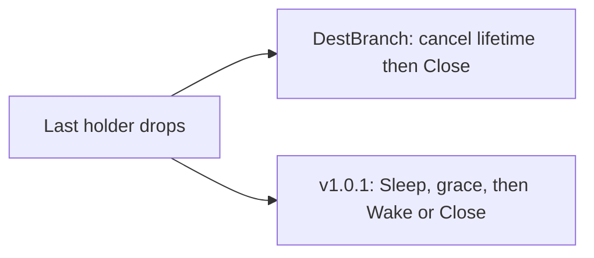

Developer review: in progress — 2026-09-14T17:57:52.510Z

## What this changes
**Operators.** None.

**Admin users.** None.

**Developers.** This branch pins sourced notes for the traefik-middleware-utilities reclaim table at v1.0.1; DestBranch still runs the in-tree `pkg/reclaim` Close-discovery table.

**End users.** None.

## Motivation
On DestBranch, plugin instances and geo catalog wrappers live in a local reclaim table that discovers `Close()` on the stored value and has no Sleep or Wake. The utilities package at v1.0.1 owns a keyed table with explicit Hooks (`Sleep`, `Wake`, `Close`), create-once, and caller-owned `New(Config)`. Keeping the fork means this plugin cannot reclaim sleepers the way the shared table does, and callers stay on a Close-only shape the ticket already rejected.

If we do not merge, later instance-reuse work still has to maintain the local copy instead of the published reclaim contract.

## Merge readiness
Prepare grounded; product import not started. 2 items remain.

Priority: P3 — spec and internal table copy, no current user or operator harm
Reviewed head: 832a533
Owner decision: None.

## Review scores
| Measure | Result | What it means |
| --- | --- | --- |
| Overall readiness | 6/6 | Stub CI succeeded and there are no open PR comments |
| CI proof | 6/6 | Lint, Test, and Integration Tests succeeded |
| Local tests proof | N/A | Before implement on a remote PR |
| Review resolution | 6/6 | No open PR comments |

## Verification
| Check | Result | Evidence |
| --- | --- | --- |
| Branch | 2026-09-14-import-reclaim-table pushed | `git` tracking origin |
| OpenSpec | none | `openspec/` |
| Pull request | https://github.com/david-garcia-garcia/traefik-geoblock/pull/84 | pr-host |
| CI | build 34877638824 succeeded https://github.com/david-garcia-garcia/traefik-geoblock/actions/runs/34877638824 | GitHub check runs |
| Local tests | none | handoff.yaml localTests |
| PR comments | no comments | pull_request_read |

## Specs
None.

## Deviations from the ask
None.

## Follow-up issues
None.

## How this fits together
Local ticket on branch `2026-09-14-import-reclaim-table`, stub PR 84, CI green on the prepare commits.

## Explore Decisions
None.

## Before merge
- [ ] Replace `pkg/reclaim` with the v1.0.1 shape including Sleep, Wake, and Close hooks
- [ ] Wire `plugin.go`, `OpenBIN`, and `OpenMMDB` to `Hooks`
- [x] Requirement grounded (`qualified-with-gaps`)
- [x] Stub PR opened
- [x] CI succeeded on head `832a533`

## Findings
None.

## Axis review
None.

## Agent review details

### Review metrics
| Metric | Value | Why it matters |
| --- | --- | --- |
| Specs in this PR | none | Same list as ## Specs |
| Open reviewer comments walked | 0 FIX / 0 ANSWER / 0 open | Unanswered review is merge risk |
| Reviewed head | 832a5334c699983baa661a2c195a9301b76908d5 | Card must match the branch you measured |

### Stored data model
None.

### Technical review
Best possible solution: DestBranch still owns a Close-only in-tree table; this head only records the v1.0.1 contract to import.

Do we have a high-confidence way to reproduce? Yes, `pkg/reclaim/table.go` Open has no Hooks argument and `stopValue` discovers Close.

Is this the best way to solve the issue? Not yet applied — prepare only grounded the import.

### Evidence
What I checked:
- Requirement names Sleep, Wake, and Close hooks (`requirement.md`, 832a533)
- Check runs Lint, Test, Integration Tests success (build 34877638824)
- Product delta vs origin/master is research notes only (`git diff origin/master...HEAD`)

### Rank-up moves
None.
