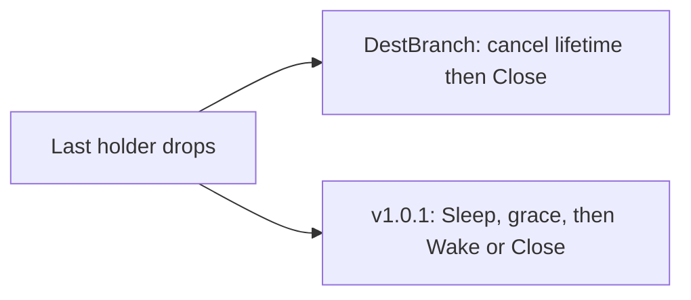

Developer review: in progress — 2026-09-14T18:04:44.467Z

## What this changes
**Operators.** None.

**Admin users.** None.

**Developers.** This branch pins sourced notes for the traefik-middleware-utilities reclaim table at v1.0.1; DestBranch still runs the in-tree `pkg/reclaim` Close-discovery table.

**End users.** None.

## Motivation
On DestBranch, plugin instances and geo catalog wrappers live in a local reclaim table that discovers `Close()` on the stored value and has no Sleep or Wake. The utilities package at v1.0.1 owns a keyed table with explicit Hooks (`Sleep`, `Wake`, `Close`), create-once, and caller-owned `New(Config)`. Keeping the fork means this plugin cannot reclaim sleepers the way the shared table does, and callers stay on a Close-only shape the ticket already rejected.

If we do not merge, later instance-reuse work still has to maintain the local copy instead of the published reclaim contract.

## Merge readiness
Explore recorded copy-into-pkg/reclaim with Close-only Hooks; product import not started. 2 items remain.

Priority: P3 — spec and internal table copy, no current user or operator harm
Reviewed head: fe58d45
Owner decision: Required. See Explore Decisions.

## Review scores
| Measure | Result | What it means |
| --- | --- | --- |
| Overall readiness | 3/6 | CI on the explore head is still running |
| CI proof | 3/6 | Lint, Test, and Integration Tests in progress |
| Local tests proof | N/A | Before implement on a remote PR |
| Review resolution | 6/6 | No open PR comments |

## Verification
| Check | Result | Evidence |
| --- | --- | --- |
| Branch | 2026-09-14-import-reclaim-table pushed | `git` tracking origin |
| OpenSpec | none | `openspec/` |
| Pull request | https://github.com/david-garcia-garcia/traefik-geoblock/pull/84 | pr-host |
| CI | build 34878552875 in progress https://github.com/david-garcia-garcia/traefik-geoblock/actions/runs/34878552875 | GitHub check runs |
| Local tests | none | handoff.yaml localTests |
| PR comments | no comments | pull_request_read |

## Specs
None.

## Deviations from the ask
None.

## Follow-up issues
None.

## How this fits together
Local ticket on branch `2026-09-14-import-reclaim-table`, stub PR 84, explore decisions recorded, CI in progress on fe58d45.

## Explore Decisions
| Question | Rank | Decision | By |
| --- | --- | --- | --- |
| Copy v1.0.1 into `pkg/reclaim`, or `go.mod` require `github.com/david-garcia-garcia/traefik-middleware-utilities/reclaim`? | structural asked | assumed — copy the pinned v1.0.1 sources into `pkg/reclaim`. Do not add a module require. | explore |
| Which of Plugin / BIN / MMDB need non-nil Sleep and Wake versus a Close-only `Hooks{Close: ...}` once the API is `Hooks`? | bounded asked | assumed — Close-only for all three. Sleep and Wake stay nil. | explore |
| After Default goes away, who holds the `*Table`, and how do tests that call `dbwrappers.Reset` / `ResetWith` still tear down plugin and wrapper incarnations? | bounded asked | assumed — plugin root holds one table; `pkg/dbwrappers` holds one table. Plugin tests that called `dbwrappers.Reset` for `plugin:` keys must also Reset the plugin-root table. | explore |
| Should any caller set `Hooks.EnforceCloseBeforeOpen`? | additive asked | assumed — false for Plugin, BIN, and MMDB (remote default). | explore |

## Before merge
- [ ] Replace `pkg/reclaim` with the v1.0.1 shape including Sleep, Wake, and Close hooks
- [ ] Wire `plugin.go`, `OpenBIN`, and `OpenMMDB` to Close-only `Hooks`
- [x] Requirement grounded (`qualified-with-gaps`)
- [x] Explore recorded (copy in-tree, Close-only Hooks, two caller-owned tables)
- [x] Stub PR opened

## Findings
None.

## Axis review
None.

## Agent review details

### Review metrics
| Metric | Value | Why it matters |
| --- | --- | --- |
| Specs in this PR | none | Same list as ## Specs |
| Open reviewer comments walked | 0 FIX / 0 ANSWER / 0 open | Unanswered review is merge risk |
| Reviewed head | fe58d45c45428b716f75b31ef24045c1011b7f9a | Card must match the branch you measured |

### Stored data model
None.

### Technical review
Best possible solution: DestBranch still owns a Close-only in-tree table; this head records the v1.0.1 contract and how callers will pass Close-only Hooks.

Do we have a high-confidence way to reproduce? Yes, `pkg/reclaim/table.go` Open has no Hooks argument and `stopValue` discovers Close.

Is this the best way to solve the issue? Not yet applied — explore chose an in-tree copy matching Yaegi plugin packaging.

### Evidence
What I checked:
- `explore.md` Open questions (fe58d45)
- Check runs Lint, Test, Integration Tests in progress (build 34878552875)
- Product delta vs origin/master is research notes only (`git diff origin/master...HEAD`)

### Rank-up moves
None.
