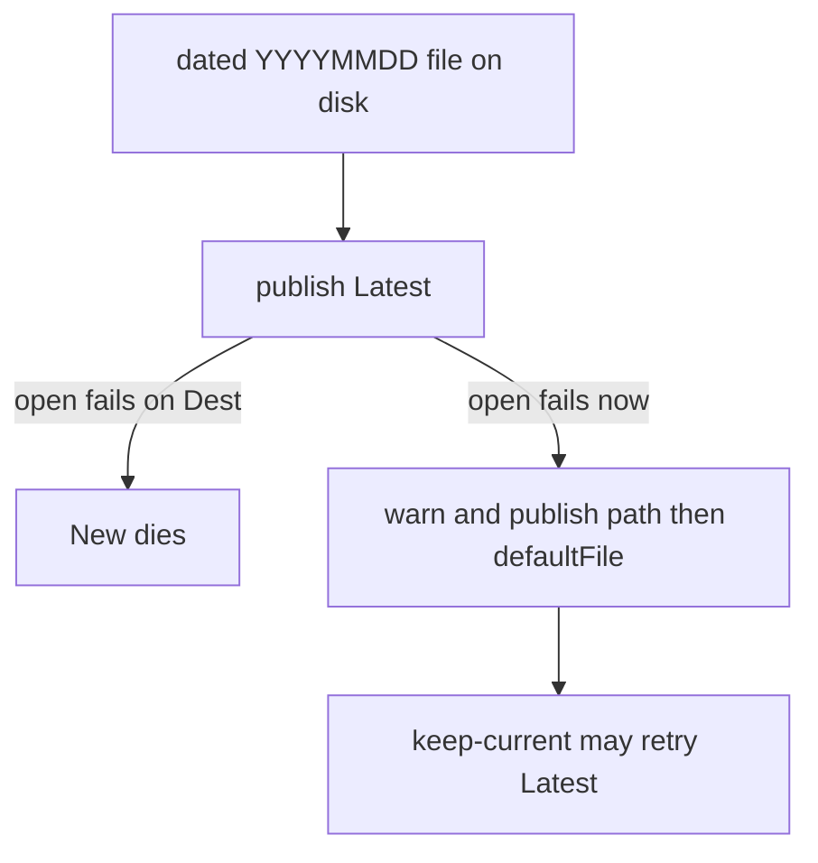

Developer review: in progress — 2026-09-16T17:36:06Z

## What this changes
**Operators.** A `/0` allow no longer exempts a more-specific block. An unreadable dated catalog file no longer takes the middleware down (seed + warning). Mapping `countryHeader` to a non-country enrich key still loads and now warns. No client IP follows `banIfError`.

**Admin users.** None.

**Developers.** `decide` compares CIDR lengths including 0. `blockFromHeader` treats an empty `GetRemoteIPs` as a lookup error. `lifecycle.initialize` falls back to catalog `path` / `defaultFile` when Latest cannot be opened. Block-mode `Lookup` returns `catalog is not bound`. Preset maps live in `presets_bin.go` / `presets_mmdb.go`.

**End users.** A request that used to pass on a `/0` allow + `/32` block, or with no hop while `banIfError` is true, is now blocked.

## Motivation
Dest treated prefix length 0 as “no allow”, so `0.0.0.0/0` beat `8.8.8.8/32` and the README contract was false. Resolve handed an unreadable dated file to publish and `New` failed despite a valid seed. An empty hop list wrote `pass:none` and reached the backend while `banIfError` was true. Those are the contracts the operator already documented or asked for.

## Merge readiness
PR is open. Lint and Test succeeded; Integration Tests are still running. 1 item remains.

Priority: P1 — Dest served a wrong CIDR contract and a corrupt dated file could take the middleware down
Reviewed head: ccab25d
Owner decision: Required. See Explore Decisions.

## Review scores
| Measure | Result | What it means |
| --- | --- | --- |
| Overall readiness | 3/6 | CI still in progress |
| CI proof | 3/6 | Lint success, Test success, Integration Tests in progress — [run 35129018169](https://github.com/david-garcia-garcia/traefik-geoblock/actions/runs/35129018169) |
| Local tests proof | N/A | remote prHost; local `go test` of geoblock/dbwrappers/root passed during implement |
| Review resolution | 6/6 | no PR comments |

## Verification
| Check | Result | Evidence |
| --- | --- | --- |
| Branch | 20260916fixes pushed | git / GitHub MCP |
| OpenSpec | policy-guards-and-seed-fallback | openspec/changes/ |
| Pull request | https://github.com/david-garcia-garcia/traefik-geoblock/pull/92 | GitHub MCP |
| CI | run 35129018169 Lint success, Test success, Integration Tests in progress | GitHub MCP get_check_runs |
| Local tests | passed | handoff.yaml localTests |
| PR comments | no comments | comments: none |

## Specs
- [core_geoblock_plugin_request-mode](https://github.com/david-garcia-garcia/traefik-geoblock/blob/20260916fixes/openspec/changes/policy-guards-and-seed-fallback/proposal.md) — modified
- [core_geoblock_database_url-download](https://github.com/david-garcia-garcia/traefik-geoblock/blob/20260916fixes/openspec/changes/policy-guards-and-seed-fallback/proposal.md) — modified

## Deviations from the ask
- taken: dedicated worktree / branch=IssueKey → stay on `20260916fixes` — `skill:opd-prepare` worktree / branch step — human forbade a worktree. Requester: confirmed
- taken: prepare Task on model_basic → conductor wrote the bus — `skill:opd-prepare:Delegate` — settings slug not in Task allowlist. Requester: not asked
- taken: countryHeader mandatory in block mode → keep X-IPCountry default — `pkg/geoblock/config.go` Prepare — the job is a header name. Requester: not asked
- taken: seven Task agents on model_implementation → conductor wrote the axis files — `skill:opd-codereview:Spawn axes` — settings slug not in Task allowlist. Requester: not asked

## Follow-up issues
None.

## How this fits together
Chat spec → `devstate/2026/09/2026-09-16-fixes/` on `20260916fixes` → [PR 92](https://github.com/david-garcia-garcia/traefik-geoblock/pull/92) → CI run 35129018169 in progress.

## Explore Decisions
| Question | Rank | Decision | By |
| --- | --- | --- | --- |
| In mode=block, reject omitted countryHeader? | bounded asked | assumed — keep X-IPCountry default | explore |
| Keep-current retry the same corrupt Latest? | additive asked | assumed — yes; do not delete the file | explore |
| Block-mode Lookup error vs ServeHTTP only? | additive asked | assumed — return catalog-not-bound | explore |

## Before merge
- [ ] [P1] Wait until Integration Tests on [run 35129018169](https://github.com/david-garcia-garcia/traefik-geoblock/actions/runs/35129018169) finish green (Lint and Test already succeeded)

## Findings
None.

## Axis review
[Standards](https://github.com/david-garcia-garcia/traefik-geoblock/blob/20260916fixes/devstate/2026/09/2026-09-16-fixes/codereview_standards.md) — 2 total, 0 pending, 2 completed
[Nitpicks](https://github.com/david-garcia-garcia/traefik-geoblock/blob/20260916fixes/devstate/2026/09/2026-09-16-fixes/codereview_nitpicks.md) — 0 total, 0 pending, 0 completed
[Spec](https://github.com/david-garcia-garcia/traefik-geoblock/blob/20260916fixes/devstate/2026/09/2026-09-16-fixes/codereview_spec.md) — 0 total, 0 pending, 0 completed
[Security](https://github.com/david-garcia-garcia/traefik-geoblock/blob/20260916fixes/devstate/2026/09/2026-09-16-fixes/codereview_security.md) — 0 total, 0 pending, 0 completed
[Performance](https://github.com/david-garcia-garcia/traefik-geoblock/blob/20260916fixes/devstate/2026/09/2026-09-16-fixes/codereview_performance.md) — 0 total, 0 pending, 0 completed
[Dead](https://github.com/david-garcia-garcia/traefik-geoblock/blob/20260916fixes/devstate/2026/09/2026-09-16-fixes/codereview_dead.md) — 0 total, 0 pending, 0 completed
[Test coverage](https://github.com/david-garcia-garcia/traefik-geoblock/blob/20260916fixes/devstate/2026/09/2026-09-16-fixes/codereview_coverage.md) — 1 total, 0 pending, 0 completed, 1 skipped

## Agent review details

### Review metrics
| Metric | Value | Why it matters |
| --- | --- | --- |
| Specs in this PR | 0 added / 2 modified | Same list as ## Specs |
| Open reviewer comments walked | 0 FIX / 0 ANSWER / 0 open | Unanswered review is merge risk |
| Reviewed head | ccab25d7e4dd961c146164079a973135b89b5953 | Card must match the branch you measured |

### Stored data model
None.

### Technical review
Best possible solution: Dest already had prefix compare, seed publish, and `banIfError`; this change makes those owners honour length 0, an unreadable Latest, and an empty hop list instead of adding a second policy.

Do we have a high-confidence way to reproduce? Yes, the new policy and seed tests fail if those hunks revert.

Is this the best way to solve the issue? Yes — fallback stays in `lifecycle.initialize` (path picker stays a path picker) and hop ownership stays on `GetRemoteIPs`.

### Evidence
What I checked:
- Pinned `origin/master...HEAD` excluding `devstate/` and `.cursor/` (git, ccab25d)
- Seven axis files under the run root (codereview)
- PR 92 check runs via GitHub MCP `pull_request_read` get_check_runs (run 35129018169)

### Rank-up moves
None.
